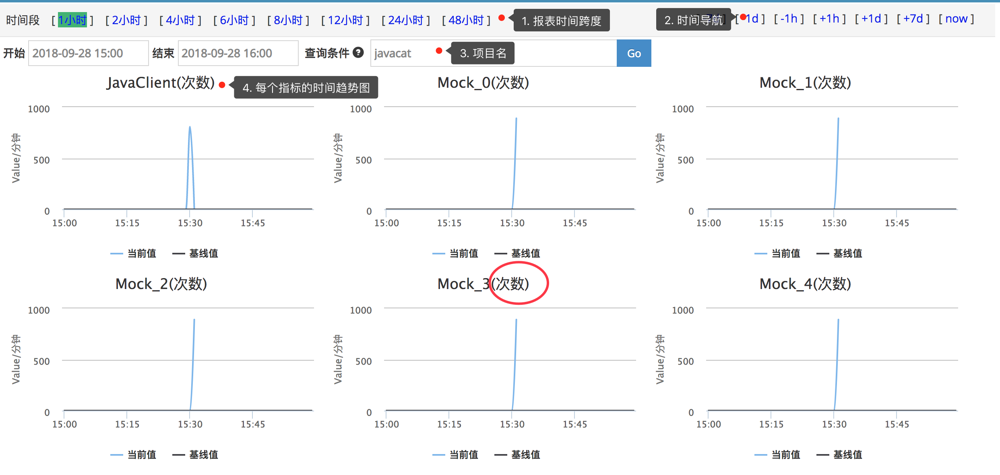

## Business报表


### 主要功能
Business报表对应着业务指标，比如订单指标。与Transaction、Event、Problem不同，Business更偏向于宏观上的指标，另外三者偏向于微观代码的执行情况。

场景示例：
```
1. 我想监控订单数量。
2. 我想监控订单耗时。
```


### 报表介绍



从上而下分析报表：

1. **报表时间跨度**：cat默认是以一小时为统计时间跨度，Business报表可以切换时间跨度，最大为两天。
2. **时间导航** 通过右上角时间导航栏选择时间：点击[+1h]/[-1h]切换时间为下一小时/上一小时；点击[+1d]/[-1d]切换时间为后一天的同一小时/前一天的同一小时；点击右上角[+7d]/[-7d]切换时间为后一周的同一小时/前一周的同一小时；点击[now]回到当前小时。
3. **项目选择** 输入项目名，查看项目数据；如果需要切换其他项目数据，输入项目名，回车即可。
4. **指标报表** 指标报表，可以看到所有上报指标的时间趋势，有个数和平均延时两种类型指标。


### 基线

基线是对业务指标的预测值。

#### 基线生成算法： 
    
最近一个月的4个每周几的数据加权求和平均计算得出，秉着更加信任新数据的原则，cat会基于历史数据做异常点的修正，会把一些明显高于以及低于平均值的点剔除。

举例：今天是2018-10-25（周四），今天整天基线数据的算法是最近四个周四（2018-10-18，2018-10-11，2018-10-04，2018-09-27）的每个分钟数据的加权求和或平均，权重值依次为1，2，3，4。如：当前时间为19:56分设为value，前四周对应的19:56分数据（由远及近）分别为A,B,C,D，则value = (A+2B+3C+4D) / 10。

对于刚上线的应用，第一天没有基线，第二天的基线基线是前一天的数据，以此类推。

#### 如何开启基线：

只有配置了基线告警的指标，才会自动计算基线。如需基线功能，请配置基线告警。


### 注意事项
1. `打点尽量用纯英文，不要带一些特殊符号，例如 空格( )、分号(:)、竖线(|)、斜线(/)、逗号(,)、与号(&)、星号(*)、左右尖括号(<>)、以及一些奇奇怪怪的字符`
2. `如果有分隔需求，建议用下划线(_)、中划线(-)、英文点号(.)等`
3. `由于数据库不区分大小写，请尽量统一大小写，并且不要对大小写进行改动`
4. `有可能出现小数：趋势图每个点都代表一分钟的值。假设监控区间是10分钟，且10分钟内总共上报5次，趋势图中该点的值为5%10=0.5`

