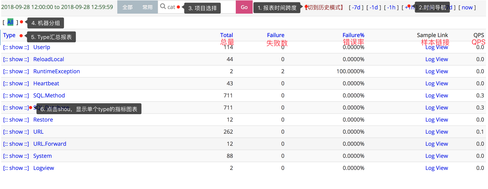
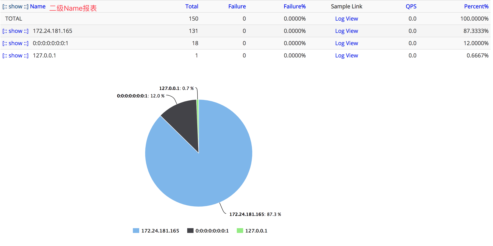
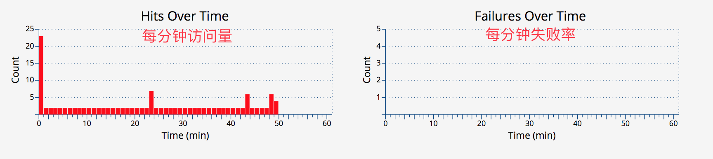
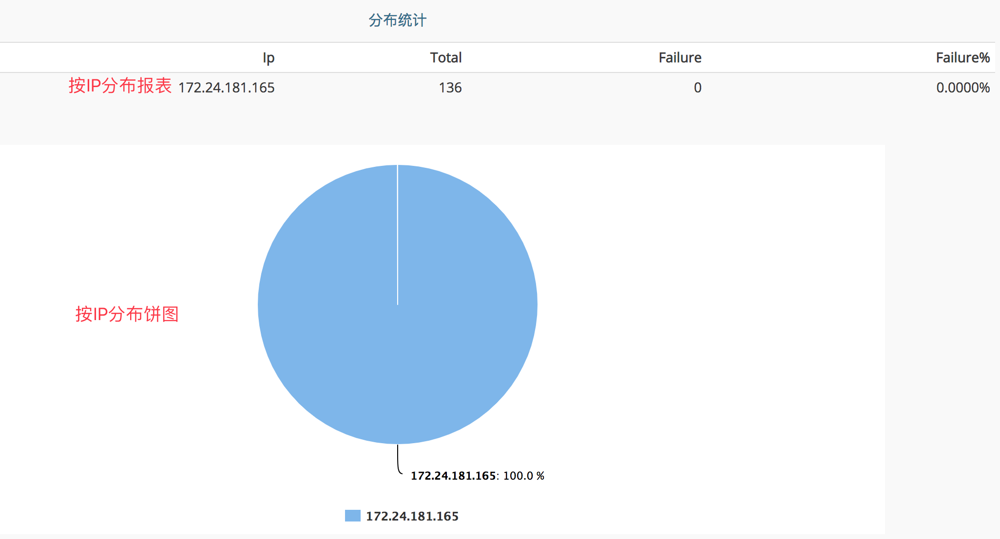

## Event报表
### 主要功能

监控一段代码运行次数：`例如记录程序中一个事件记录了多少次，错误了多少次`。Event报表的整体结构与Transaction报表几乎一样，只缺少响应时间的统计。

应用启动后默认会打点的部分:

|  打点 | 来源组件 | 描述 |
| --- | --- | --- |
| System | cat-client | 上报监控数据的打点信息、Reboot重启等 |

### 报表介绍 
#### 第一级分类（Type）统计界面

Type统计界面展示了一个Event的第一层分类的视图，Event相对于Transaction少了运行时间统计。可以知道这段时间里面一个分类运行的次数，失败次数，失败率，采样logView，QPS。

#### 第二级分类（Name）统计界面
第二级分类在Type统计界面中点击具体的Type进入，展示的是相同type下所有的name数据，可以理解为某type下更细化的分类。

#### Type统计界面详细介绍



从上而下分析报表：

1. **报表的时间跨度**：cat默认是以一小时为统计时间跨度，点击[切到历史模式]，更改查看报表的时间跨度：默认是小时模式；切换为历史模式后，右侧快速导航，变为month(月报表)、week(周报表)、day(天报表)，可以点击进行查看，注意报表的时间跨度会有所不同。
2. **时间选择** 通过右上角时间导航栏选择时间：点击[+1h]/[-1h]切换时间为下一小时/上一小时；点击[+1d]/[-1d]切换时间为后一天的同一小时/前一天的同一小时；点击右上角[+7d]/[-7d]切换时间为后一周的同一小时/前一周的同一小时；点击[now]回到当前小时。
3. **项目选择** 输入项目名，查看项目数据；如果需要切换其他项目数据，输入项目名，回车即可。
4. **机器分组** cat可以将若干个机器，作为一个分组进行数据统计。默认会有一个All分组，代表所有机器的统计数据，即集群统计数据。
5. **所有Type汇总报表** 第一层分类（Type），点击查看第二级分类（称为<font color=#FF4500>name</font>）数据：
    - Event的埋点的Type和Name由业务自己定义，当打点了Cat.newEvent(type, name)时，第一层分类是type，第二级分类是name。
    - 第二级分类数据叫是统计相同type下的所有name数据，如下图，数据均与第一级（type）一样的展示风格：
    

6. **指标说明** 显示的是小时粒度第一级分类（type）的次数、错误数、失败率等数据。




7. **指标说明** 显示的是小时粒度第一级分类（type）的次数、错误数、失败率等数据。
8. **样本logview** sample中是采样的调用链路对应的MessageTree信息

### 示例说明
#### 想记录在某个方法中一个条件分支中分支1中的函数调用了多少次，分支2中的函数调用了多少次，又失败了多少次。
以下是代码示例：

```java
public void testEvent() {
    for (int i = 0; i < 100; i++) {
        Transaction t = Cat.newTransaction("Trans", "test");

        for (int j = 0; j < 6000; j++) {
            if (j % 3 == 0) {
                func1();
                Cat.logEvent("Func", "Func1");
            } else {
                boolean result = func2();
                Event e = Cat.newEvent("Func", "Func2");

                if (result) {
                    e.setSuccessStatus();
                } else {
                    e.setStatus("False");
                }
                e.complete();

            }
        }

        t.setStatus(Transaction.SUCCESS);
        t.complete();
    }
}

private void func1() {

}

private boolean func2() {
    Random random = new Random();
    int res = random.nextInt(100);
    if (res % 2 == 0)
        return false;
    return true;
}
```