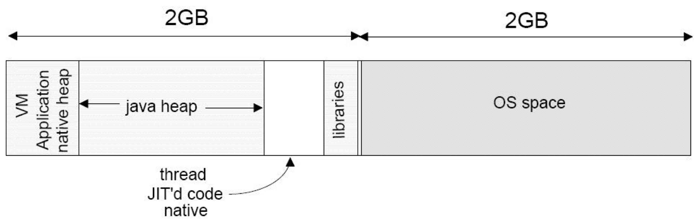
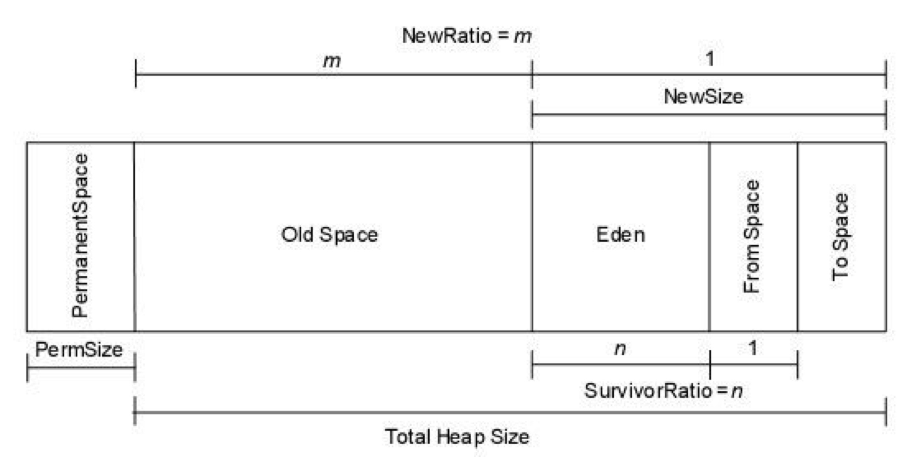
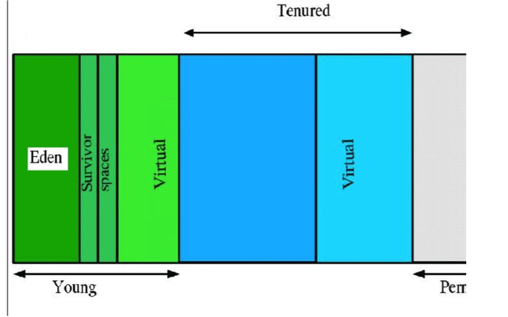
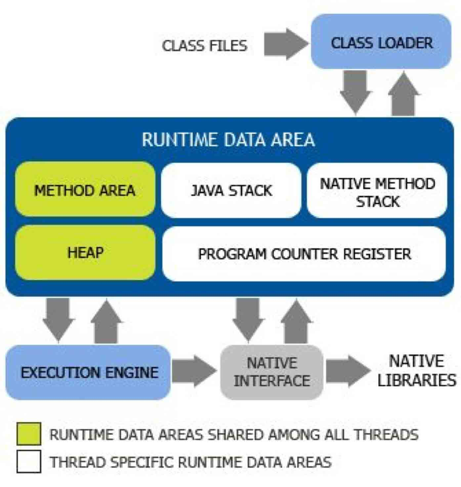

#Heartbeat报表
## 监控指标介绍
### 1 JVM相关指标

以下所有的指标统计都是1分钟内的值，cat最低统计粒度是一分钟。

JVM GC 相关指标 | 描述
  ---|---
NewGc Count / PS Scavenge Count | 新生代GC次数
NewGc Time / PS Scavenge Time | 新生代GC耗时
OldGc Count | 老年代GC次数
PS MarkSweepTime | 老年代GC耗时
Heap Usage  | Java虚拟机堆的使用情况
None Heap Usage | Java虚拟机Perm的使用情况

JVM Thread 相关指标 | 描述
  ---|---
Active Thread | 系统当前活动线程
Daemon Thread | 系统后台线程
Total Started Thread  | 系统总共开启线程
Started Thread  | 系统每分钟新启动的线程
Cat Started Thread  | 系统中CAT客户端启动线程

可以参考java.lang.management.ThreadInfo的定义 

### 2 系统指标
System 相关指标 | 描述
  ---|---
System Load Average | 系统Load详细信息
Memory Free | 系统memoryFree情况
FreePhysicalMemory | 物理内存剩余空间
/ Free | /根的使用情况
/data Free | /data盘的使用情况

### 3 JVM 监控详细解释

#### 3.1 Java 内存

- Java 的内存通常分为堆内存和非堆内存，堆内存由 Java 对象使用，非堆内存 则用于存放 JNI、Java 线程对象等非 Java 数据。示意图如下所示： 

- 堆内存结构如下所示：

- 垃圾收集（Garbage collection）

- JVM Generational Collecting（分代）原理是这样的：把对象分为年青代（Young）、 年老代（Tenured）、持久代（Perm），对不同生命周期的对象使用不同的算法。（基于对对象生命周期分析） 

- 如上图所示，为 Java 堆中的各代分布：

##### Young（年轻代）

- 年轻代分三个区。一个 Eden 区，两个 Survivor 区。大部分对象在 Eden 区 中生成。幸存者 0 区（Survivor 0 space）和幸存者 1 区（Survivor1 space）： 当伊甸园的空间用完时，程序又需要创建对象;此时 JVM 的垃圾回收器将对 伊甸园区进行垃圾回收，将伊甸园区中的不再被其他对象所引用的对象进行销 毁工作。同时将伊甸园中的还有其他对象引用的对象移动到幸存者 0 区。幸 存者 0 区就是用于存放伊甸园垃圾回收时所幸存下来的 JAVA 对象。当将伊 甸园中的还有其他对象引用的对象移动到幸存者 0 区时，如果幸存者 0 区也 没有空间来存放这些对象时，JVM 的垃圾回收器将对幸存者 0 区进行垃圾回 收处理，将幸存者 0 区中不在有其他对象引用的 JAVA 对象进行销毁，将幸存者 0 区中还有其他对象引用的对象移动到幸存者 1 区。幸存者 1 区的作 用就是用于存放幸存者 0 区垃圾回收处理所幸存下来的 JAVA 对象。

##### Tenured（年老代）

- 年老代存放从年轻代存活的对象。一般来说年老代存放的都是生命期较长的对象。

##### Perm（持久代）

- 用于存放静态文件，如今 Java 类、方法等。持久代对垃圾回收没有显著影响，但是有些应用可能动态生成或者调用一些 class，例如 Hibernate 等，在这种时候需要设置一个比较大的持久代空间来存放这些运行过程中新增的类。持久代大小通过-XX：MaxPermSize= 进行设置。
举个例子：当在程序中生成对象时，正常对象会在年轻代中分配空间，如果是过大的对象也可能会直接在年老代生成（据观测在运行某程序时候每次会生成 一个十兆的 空间用收发消息，这部分内存就会直接在年老代分配）。年轻代 在空间被分配完的时候就会发起内存回收，大部分内存会被回收，一部分幸存 的内存会被拷贝至 Survivor 的 from 区，经过多次回收以后如果 from 区内存 也分配完毕，就会也发生内存回收然后将剩余的对象拷贝至 to 区。等到 to 区 也满的时候，就会再次发生内存回收然后把幸存的对象拷贝至年老区。 通常我们说的 JVM 内存回收总是在指堆内存回收，确实只有堆中的内容是动态申请分配的，所以以上对象的年轻代和年老代都是指的 JVM 的 Heap 空间，而持久代则是之前提到的 Method Area，不属于 Heap。

#### 3.2 Class count

- Java 的运行时架构图如下： 

- JVM 主要包括两个子系统和两个组件。两个子系统分别是 Class loader 子系统和 Execution engine（执行引擎）子系统; 两个组件分别是 Runtime data area （运行时数据区域）组件和 Native interface（本地接口）组件。

- Class loader 子系统的作用：根据给定的全限定名类名（如 java.lang.Object）来装载 class 文件的内容到 Runtime data area 中的 method area（方法区域）。Java 程序员可以 extends java.lang.ClassLoader 类来写自己的 Class loader。 Execution engine 子系统的作用：执行 classes 中的指令。任何 JVM specification 实现（JDK）的核心都是 Execution engine，不同的 JDK 例如 Sun 的 JDK 和 IBM 的 JDK 不同主要就取决于他们各自实现的 Execution engine 的不同。 Native interface 组件：与 native libraries 交互，是其它编程语言交互的接口。 当调用 native 方法的时候，就进入了一个全新的并且不再受虚拟机限制的世界，所以也很容易出现 JVM 无法控制的 native heap OutOfMemory。

- Runtime Data Area 组件：这就是通常所说的 JVM 的内存了。它主要分为五个部分：

    - 1 Heap （堆）：一个 Java 虚拟实例中只存在一个堆空间。
    - 2 Method Area（方法区域）：被装载的 class 的信息存储在 Method area 的内存中。当虚拟机装载某个类型时，它使用类装载器定位相应的 class 文件，然后读入这个 class 文件内容并把它传输到虚拟机中。
    - 3 Java Stack（java 的栈）：虚拟机只会直接对 Java stack 执行两种操作：以帧为单位的压栈或出栈。
    - 4 Program Counter（程序计数器）：每一个线程都有它自己的 PC 寄存器，也是该线程启动时创建的。PC 寄存器的内容总是指向下一条将被执行指令的地址，这里的地址可以是一个本地指针，也可以是在方法区中相对应于该方法起始指令的偏移量。
    - 5 Native method stack（本地方法栈）：保存 native 方法进入区域的地址。

#### 3.3 线程

- 线程，是程序运行的基本执行单元。当操作系统（不包括单线程的操作系统，如微软早期的 DOS）在执行一个程序时，会在系统中建立一个进程，而在这个进程中，必须至少建立一个线程（这个线程被称为主线程）来作为这个程序运行的入口点。因此，在操作系统中运行的任何程序都至少有一个主线程。

- 进程和线程是现代操作系统中两个必不可少的运行模型。在操作系统中可以有多个进程，这些进程包括系统进程（由操作系统内部建立的进程）和用户进程（由用户程序建立的进程）;一个进程中可以有一个或多个线程。进程和进程之间不共享内存，也就是说系统中的进程是在各自独立的内存空间中运行的。而一个进程中的线可以共享系统分派给这个进程的内存空间。

- 线程不仅可以共享进程的内存，而且还拥有一个属于自己的内存空间，这段内存空间也叫做线程栈，是在建立线程时由系统分配的，主要用来保存线程内部所使用的数据，如线程执行函数中所定义的变量。在操作系统将进程分成多个线程后，这些线程可以在操作系统的管理下并发执行，从而大大提高了程序的运行效率。

