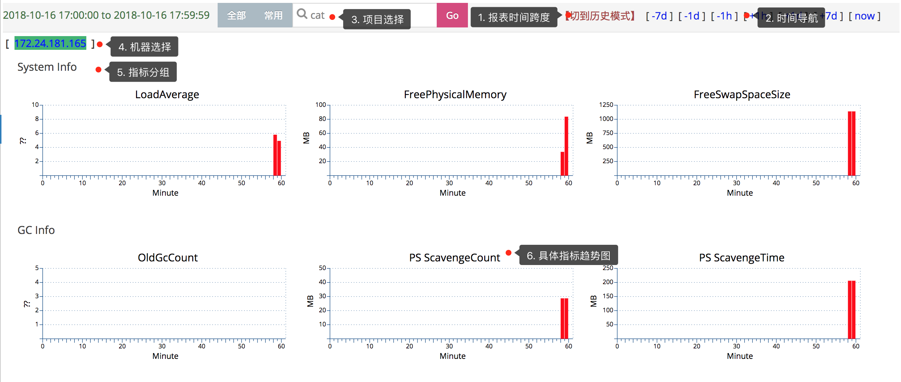

## Heartbeat报表

### 报表介绍

Heartbeat报表是CAT客户端，以一分钟为周期，定期向服务端汇报当前运行时候的一些状态。

从上而下分析报表：

1. **报表时间跨度**：cat默认是以一小时为统计时间跨度，点击[切到历史模式]，更改查看报表的时间跨度：默认是小时模式；切换为历史模式后，右侧快速导航，变为month(月报表)、week(周报表)、day(天报表)，可以点击进行查看，注意报表的时间跨度会有所不同。
2. **时间导航** 通过右上角时间导航栏选择时间：点击[+1h]/[-1h]切换时间为下一小时/上一小时；点击[+1d]/[-1d]切换时间为后一天的同一小时/前一天的同一小时；点击右上角[+7d]/[-7d]切换时间为后一周的同一小时/前一周的同一小时；点击[now]回到当前小时。
3. **项目选择** 输入项目名，查看项目数据；如果需要切换其他项目数据，输入项目名，回车即可。
4. **机器分组** CAT以机器为粒度展示心跳报表；选择一个具体的机器IP，查看该机器的心跳状态。
5. **指标分组** 心跳指标分组，比如系统指标（System Info）、GC指标（GC Info）、JVM指标（JVMHeap Info）等。
6. **指标趋势图** 以分钟为粒度，展示一个具体指标值的时间趋势。

### 监控指标介绍
#### JVM相关指标

以下所有的指标统计都是1分钟内的值，cat最低统计粒度是一分钟。

JVM GC 相关指标 | 描述
  ---|---
NewGc Count / PS Scavenge Count | 新生代GC次数
NewGc Time / PS Scavenge Time | 新生代GC耗时
OldGc Count | 老年代GC次数
PS MarkSweepTime | 老年代GC耗时
Heap Usage  | Java虚拟机堆的使用情况
None Heap Usage | Java虚拟机Perm的使用情况

JVM Thread 相关指标 | 描述
  ---|---
Active Thread | 系统当前活动线程
Daemon Thread | 系统后台线程
Total Started Thread  | 系统总共开启线程
Started Thread  | 系统每分钟新启动的线程
CAT Started Thread  | 系统中CAT客户端启动线程

可以参考java.lang.management.ThreadInfo的定义 

#### 系统指标
System 相关指标 | 描述
  ---|---
System Load Average | 系统Load详细信息
Memory Free | 系统memoryFree情况
FreePhysicalMemory | 物理内存剩余空间
/ Free | /根的使用情况
/data Free | /data盘的使用情况
