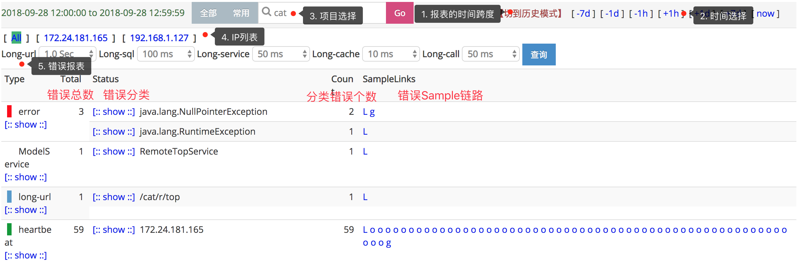
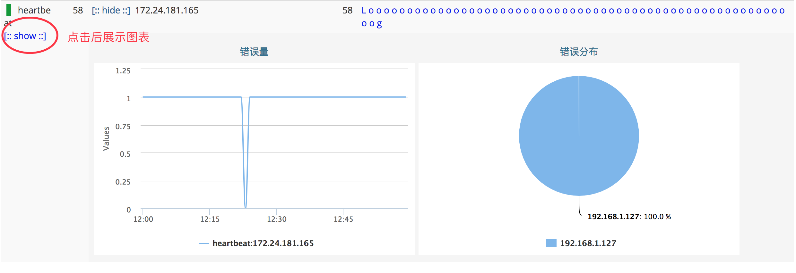
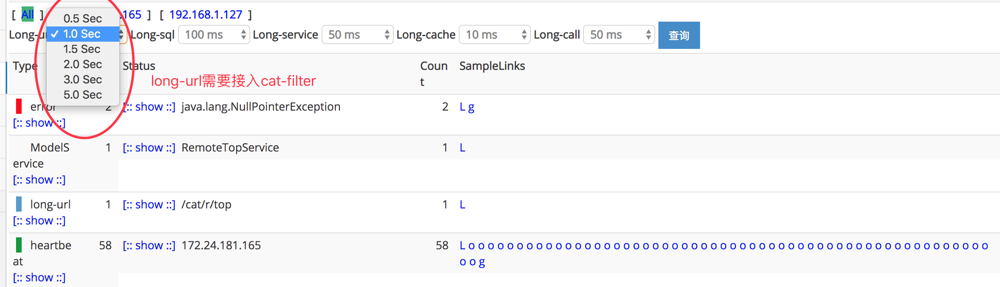

## Problem报表
### 主要功能

Problem记录整个项目在运行过程中出现的问题，包括一些异常、错误、访问较长的行为。Problem报表是由logview存在的特征整合而成，方便用户定位问题。	
来源：		

1. 业务代码显示调用Cat.logError(e) API进行埋点，具体埋点说明可查看埋点文档。
2. 与LOG框架集成，会捕获log日志中有异常堆栈的exception日志。

###报表介绍
	

从上而下分析报表：

1. **报表的时间跨度**：cat默认是以一小时为统计时间跨度，点击[切到历史模式]，更改查看报表的时间跨度：默认是小时模式；切换为历史模式后，右侧快速导航，变为month(月报表)、week(周报表)、day(天报表)，可以点击进行查看，注意报表的时间跨度会有所不同。
2. **时间选择** 通过右上角时间导航栏选择时间：点击[+1h]/[-1h]切换时间为下一小时/上一小时；点击[+1d]/[-1d]切换时间为后一天的同一小时/前一天的同一小时；点击右上角[+7d]/[-7d]切换时间为后一周的同一小时/前一周的同一小时；点击[now]回到当前小时。
3. **项目选择** 输入项目名，查看项目数据；如果需要切换其他项目数据，输入项目名，回车即可。
4. **IP选择** 可以选择一个具体IP，默认为All，代表整个集群。
5. **所有错误汇总报表** 第一层分类（Type），代表错误类型，比如error、long-url等；第二级分类（称为Status），对应具体的错误，比如一个异常类名等。
6. **错误数分布** 点击type和status的show，分别展示type和status的分钟级错误数分布：	
7. **链路sample** 原始日志查看里一般会有出错的整个链路及错误堆栈，这里默认展示60条log。
8. **自定义阈值** 对于较长耗时，也认为是problem错误，cat可以选择不同的耗时阈值。例如：接入cat-filter后，此处可以选择long-url不同的阈值，筛选不同的长URL。
	