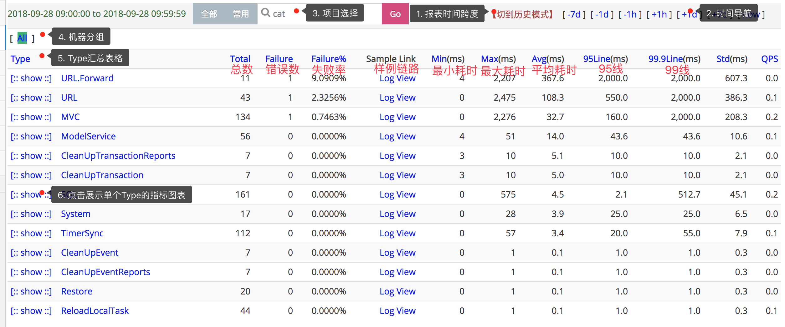
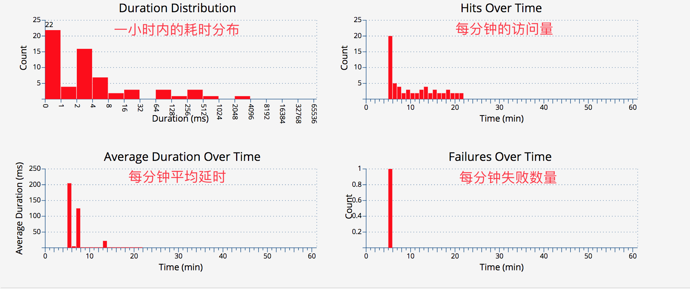
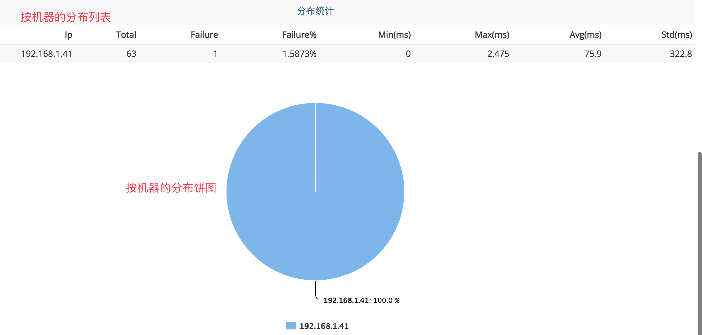

## Transaction报表
### 主要功能

监控一段代码运行情况：`运行次数、QPS、错误次数、失败率、响应时间统计（平均影响时间、Tp分位值）等等`。

应用启动后默认会打点的部分:

|  打点 | 来源组件 | 描述 |
| --- | --- | --- |
| System | cat-client | 上报监控数据的打点信息 |
| URL |  需要接入cat-filter | URL访问的打点信息 |


### 报表介绍
#### 第一级分类（Type）统计界面

Type统计界面展示了一个Transaction的第一层分类的视图，可以知道这段时间里面一个分类运行的次数，平均响应时间，延迟，以及分位线。




从上而下分析报表：

1. **报表的时间跨度** CAT默认是以一小时为统计时间跨度，点击[切到历史模式]，更改查看报表的时间跨度：默认是小时模式；切换为历史模式后，右侧快速导航，变为month(月报表)、week(周报表)、day(天报表)，可以点击进行查看，注意报表的时间跨度会有所不同。
2. **时间选择** 通过右上角时间导航栏选择时间：点击[+1h]/[-1h]切换时间为下一小时/上一小时；点击[+1d]/[-1d]切换时间为后一天的同一小时/前一天的同一小时；点击右上角[+7d]/[-7d]切换时间为后一周的同一小时/前一周的同一小时；点击[now]回到当前小时。
3. **项目选择** 输入项目名，查看项目数据；如果需要切换其他项目数据，输入项目名，回车即可。
4. **机器分组** CAT可以将若干个机器，作为一个分组进行数据统计。默认会有一个All分组，代表所有机器的统计数据，即集群统计数据。
5. **所有Type汇总表格** 第一层分类（Type），点击查看第二级分类（称为<font color=#FF4500>name</font>）数据：
    - Transaction的埋点的Type和Name由业务自己定义，当打点了Cat.newTransaction(type, name)时，第一层分类是type，第二级分类是name。
    - 第二级分类数据叫是统计相同type下的所有name数据，数据均与第一级（type）一样的展示风格

6. **单个Type指标图表** 点击show，查看Type所有name分钟级统计，如下图:



7. **指标说明** 显示的是小时粒度第一级分类（type）的次数、错误数、失败率等数据。
8. **样本logview** L代表logview，为一个样例的调用链路。
9. **分位线说明** 小时粒度的时间第一级分类（type）相关统计

    - 95line表示95%的请求的响应时间比参考值要小，999line表示99.9%的响应时间比参考值要小，95line以及99line，也称之为tp95、tp99。

#### Transaction历史报表

Transaction历史报表支持每天、每周、每月的数据统计以及趋势图，点击导航栏的切换历史模式进行查询。Transaction历史报表以响应时间、访问量、错误量三个维度进行展示，以天报表为例：选取一个type，点击show，即可查看天报表。

### 最佳实践
#### TP分位线计算逻辑
- CAT基于全量数据，在单台机器的上单个小时内部，做全量的区间分桶，在区间分桶也做了部分优化，时间越大桶的区间粒度越大，最后根据count找出分位。
- CAT内部是自己实现的模型和存储，本身支持增加合并和计算，分位线这类并不是适合增量计算，必须依赖全量数据才可以，但是全量的数据存储量非常之大。<font color=#FF4500>Transaction报表目前准确统计小时范围单台机器级别分钟级的TP数据</font>。如果看小时级别ALL的统计，是根据当前小时所有的机器进行合并的结果，主要一段时间内所有的机器响应时间波动基本一致，小时级别基本也准确，但是如果个别机器抖动特别大，这个所有的统计会失真。
- CAT后端天、周、月级别的数据是就小时数据的合并，主要用了加权来做，如果一天整个项目的99的波动不大，天级别的99约等于小时级别99。如果一天内的某几个小时的tp99 比较大的话，此做法就会有误差，比如某个服务一天有好几个小时tp99的数据都是正常其他时间段的10倍，这样天级别的99误差就比较大。简而言之天、周、月TP值的统计是一个根据加权算法的近似估计值。
- 分位线的统计数据，单台机器小时报表的小时粒度和分钟粒度是完全准确的，天、周、月级别、包括集群的总的分位线都是加权来计算的。计算逻辑如下：
    - 机器A的tp999是timeA，访问总量是countA
    - 机器B的tp999是timeB，访问总量是countB
    - 集群（假设只有A和B两个机器）的tp999的计算公式是：tp999 = (timeA * countA + timeB * countB) / (countA + countB)
    - 天、周、月报表计算逻辑类似，只不过把机器之间的运算换成了时间之间的运算

-  另外CAT分位线等小时内部的统计为了节省内存，也是用了近似的统计方式，当响应时间越大的话，对应的分桶跨度也越大

```
	public static int computeDuration(int duration) {
        if (duration < 1) {
            return 1;
        } else if (duration < 20) {
            return duration;
        } else if (duration < 200) {
            return duration - duration % 5;
        } else if (duration < 500) {
            return duration - duration % 20;
        } else if (duration < 2000) {
            return duration - duration % 50;
        } else if (duration < 20000) {
            return duration - duration % 500;
        } else if (duration < 1000000) {
            return duration - duration % 10000;
        } else {
            int dk = 524288;

            if (duration > 3600 * 1000) {
                dk = 3600 * 1000;
            } else {
                while (dk < duration) {
                    dk <<= 1;
                }
            }
            return dk;
        }
    }
```

### 示例说明
#### 我想监控一段核心代码的执行的情况，能看到统计报表，怎么办？

Step1: 首先，确定监控对象
        - 监控某个方法中核心逻辑的健康状况
        
Step2: 其次，确定监控指标，Transaction统计报表可以提供如下信息
        - 每分钟调用次数
        - 每分钟的平均响应时间
        - 最慢响应时间
        - 请求的时间分布
        
Step3: 然后，进行埋点（前提是已经集成cat-client)
    
   - 假设监控对象的代码为：
   
```java
public void shopService() {        
    service1();
    service2();
    service3();
}
```
        	
   - 假设shopService中service3是核心方法，对其进行CAT埋点：
        
```java
public void shopService() {        
    service1();
    service2();
    
    Transaction transaction = Cat.newTransaction("ShopService", "Service3");
    try {
        service3();
        
        transaction.setStatus(Transaction.SUCCESS);
    } catch (Exception e) {
        transaction.setStatus(e); // catch 到异常，设置状态，代表此请求失败
        Cat.logError(e); // 将异常上报到cat上
        // 也可以选择向上抛出： throw e;
    } finally {
        transaction.complete();
    }
}
```