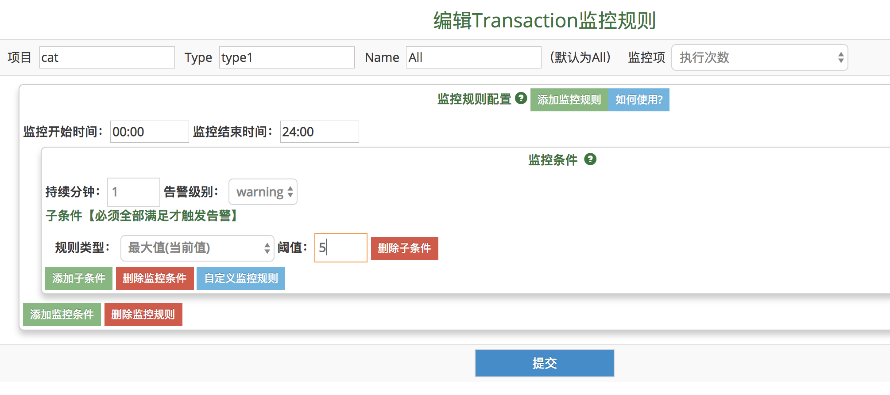
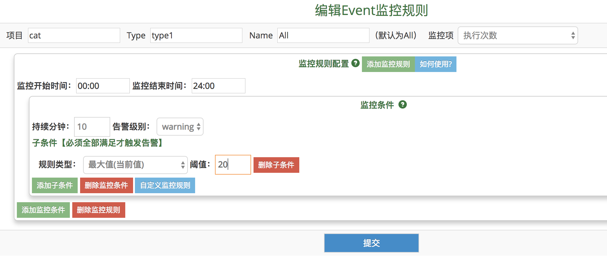
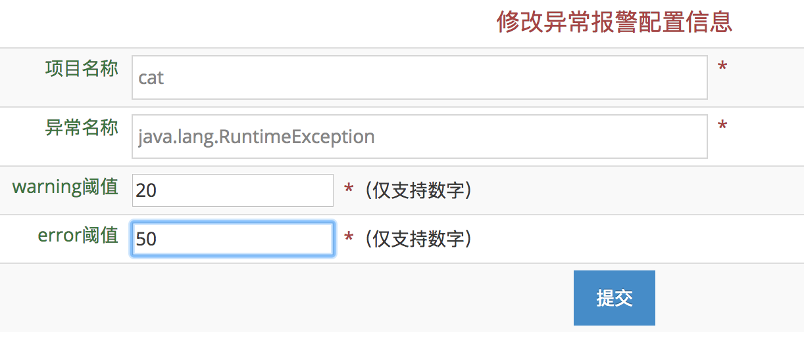
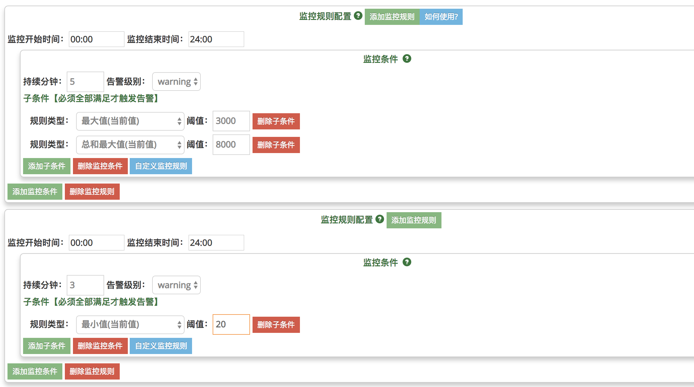

## 应用告警配置

### Transaction告警

对Transaction的告警，支持的指标有次数、延时、失败率

#### 配置图示

	
#### 配置说明：

  * 项目名：要监控的项目名
  * type：被监控transaction的type
  * name：被监控transaction的name；如果为All，代表全部name
  * 监控指标：次数、延时、失败率
  * 告警规则：详情见下文

### Event告警

对Event的个数进行告警

#### 配置图示

	
#### 配置说明：

  * 项目名：要监控的项目名
  * type：被监控event的type
  * name：被监控event的name；如果为All，代表全部name
  * 告警规则：详情见下文

### 异常告警

对异常的个数进行告警

#### 配置图示

	
#### 配置说明：

  * 项目名：要监控的项目名
  * 异常名称：被监控异常名称
  * warning阈值：到达该阈值，发送warning级别告警
  * error阈值：到达该阈值，发送error级别告警

### 告警规则

合理、灵活的监控规则可以帮助更快、更精确的发现业务线上故障。目前Cat的监控规则有五个要素，请按照以下五点要素制定规则：
  
- 告警时间段。同一项业务指标在每天不同的时段可能有不同的趋势。设定该项，可让Cat在每天不同的时间段执行不同的监控规则。注意：告警时间段，不是监控数据的时间段，只是告警从这一刻开始进行检查数据。
- 规则组合。在一个时间段中，可能指标触发了多个监控规则中的一个规则就要发出警报，也有可能指标要同时触发了多个监控规则才需要发出警报。这种关系好比电路图中的并联和串联。规则的组合合理有助于提高监控的准确度。    
- 监控规则类型。通过以下六种类型对指标进行监控：最大值、最小值、波动上升百分比、波动下降百分比、总和最大值、总和最小值。
- 监控最近分钟数。设定时间后（单位为分钟），当指标在设定的最近的时间长度内连续触发了监控规则，才会发出警报。比如最近分钟数为3，表明连续三分钟的数组都满足条件才告警。如果分钟数为1，表示最近的一分钟满足条件就告警。
- 规则与被监控指标的匹配。监控规则可以按照名称、正则表达式与监控的对象（指标）进行匹配。  
- 监控规则模型如下图所示：

##### 告警时间

1. 告警时间段，08:00 - 20:00，是指告警从08:00开始进行数据检查，直到20:00；
2. 其实检查的数据是根据告警时间段和下面设置的“监控最近分钟数”来决定的；
3. 如果只想进行边界告警（即只判断最近的变化情况），而不是水平告警（不关心最近的几分钟时间区间内的变化趋势），可以直接设置“监控最近分钟数”为1，即为判断最后一分钟数据的情况；
4. 如果对告警时间精度要求较高的业务方，可以参考进行斟酌；

##### 监控条件与子条件：
    
一个告警规则由多个监控条件组成。一个规则下的多个监控条件为并联关系，当一个监控条件被触发，整个规则就被触发。
    
监控条件中的持续分钟数表示该条件的持续时间。设定时间单位为分钟。当指标在设定的时间长度内连续触发了该条规则，才会触发该监控条件。
    
监控条件由子条件组成。一个condition下的多个子条件为串联关系，只有当一个监控条件下的全部子条件被触发，该监控条件才被触发。
    
##### 子条件类型：

有六种类型。子条件的内容为对应的阈值，请注意阈值只能由数字组成，当阈值表达百分比时，不能在最后加上百分号。八种类型如下：

   类型 | 说明
     ---|---
MaxVal	最大值（当前值）| 当前实际值 最大值，比如检查最近3分钟数据，3分钟数据会有3个value，是表示（>=N）个值都必须同时>=设定值
MinVal	最小值（当前值）| 当前实际值 最小值，比如检查最近3分钟数据，3分钟数据会有3个value，是表示（>=N）个值都必须同时比<=设定值
FluAscPer 波动上升百分比（当前值）|波动百分比最大值。即当前最后（N）分钟值比监控周期内其它分钟值（M-N个）的增加百分比都>=设定的百分比时触发警报,比如检查最近10分钟数据，触发个数为3；10分钟内数据会算出7个百分比数据，是表示最后3分钟值分别相比前面7分钟值，3组7次比较的上升波动百分比全部>=配置阈值。比如下降50%，阈值填写50。
FluDescPer 波动下降百分比（当前值）|波动百分比最小值。当前最后（N）分钟值比监控周期内其它（M-N个）分钟值的减少百分比都大于设定的百分比时触发警报，比如检查最近10分钟数据，触发个数为3；10分钟数据会算出7个百分比数据，是表示最后3分钟值分别相比前面7分钟值，3组7次比较的下降波动百分比全部>=配置阈值。比如下降50%，阈值填写50。
SumMaxVal 总和最大值（当前值）| 当前值总和最大值，比如检查最近3分钟数据，表示3分钟内的总和>=设定值就告警。
SumMinVal 总和最小值（当前值）|	当前值总和最小值，比如检查最近3分钟数据，表示3分钟内的总和<=设定值就告警。

点击"如何使用?"按钮，将会出现信息介绍设置规则的流程
