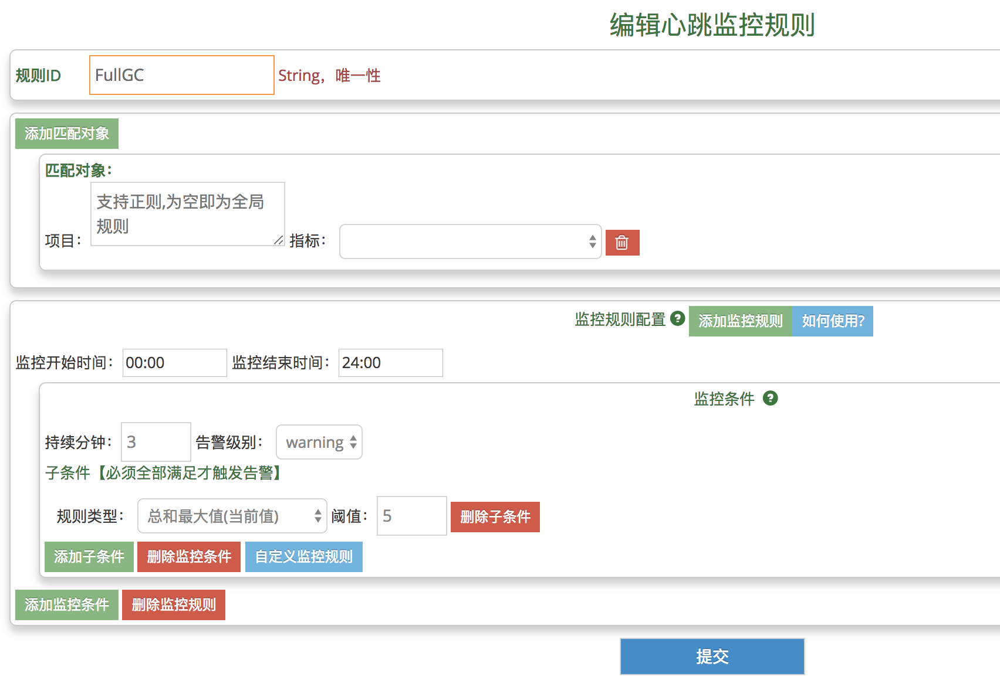

[TOC]

## 告警配置

合理、灵活的监控规则可以帮助更快、更精确的发现业务线上故障。本篇主要分为三个部分：

- 告警的通用配置：包括告警策略、默认告警人、告警服务端
- 告警规则
- 具体的四种告警类型：包括Transaction告警、Event告警、异常告警、心跳告警

### 告警通用配置

#### 告警策略

告警策略：配置某种告警类型、某个项目、某个错误级别，对应的告警发送渠道，以及暂停时间。

举例：下述配置示例，说明对于Transaction告警，当告警项目名为demo_project：

- 当告警级别为error时，发送渠道为邮件、短信、微信，连续告警之间的间隔为5分钟

- 当告警级别为warning时，发送渠道为邮件、微信，连续告警之间的间隔为10分钟

##### 配置示例

	<alert-policy>
		<type id="Transaction">
              <group id="default">
                 <level id="error" send="mail,weixin" suspendMinute="5"/>
                 <level id="warning" send="mail,weixin" suspendMinute="5"/>
              </group>
              <group id="demo-project">
                 <level id="error" send="mail,weixin,sms" suspendMinute="5"/>
                 <level id="warning" send="mail,weixin" suspendMinute="10"/>
              </group>
        </type>
	</alert-policy>
	
##### 配置说明：

  * type：告警的类型，可选：Transaction、Event、Business、Heartbeat
  * group id属性：group可以为default，代表默认，即所有项目；也可以为项目名，代表某个项目的策略，此时default策略不会生效
  * level id属性：错误级别，分为warning代表警告、error代表错误
  * level send属性：告警渠道，分为mail-邮箱、weixin-微信、sms-短信
  * level suspendMinute属性：连续告警的暂停时间

  
#### 默认告警人

某个告警类型的告警信息，均会发给默认告警人。默认告警人多用于测试。

默认告警人的第二个功能是可以直接关闭某种类型的告警。比如<receiver id="Transaction" enable="false">，代表不发送Transaction告警。

##### 配置示例

	<alert-config>
       <receiver id="Transaction" enable="true">
          <email>testUser1@test.com</email>
          <phone>12345678901</phone>
          <phone>12345678902</phone>
       </receiver>
    </alert-config>
	
##### 配置说明：

  * receiver id属性：告警的类型，可选：Transaction、Event、Business、Heartbeat
  * receiver enable属性：是否开启告警；如果为false，此类别的告警不会发出
  * email：默认邮件告警人
  * phone：默认短信告警人

#### 告警服务端

告警发送中心的配置。（什么是告警发送中心：提供发送短信、邮件、微信功能，且提供Http API的服务）

CAT在生成告警后，调用告警发送中心的Http接口发送告警。CAT自身并不集成告警发送中心，请自己搭建告警发送中心。

##### 配置示例

	<sender-config>
       <sender id="mail" url="http://test/" type="post" successCode="200" batchSend="true">
          <par id="type=1500"/>
          <par id="key=title,body"/>
          <par id="re=test@test.com"/>
          <par id="to=${receiver}"/>
          <par id="value=${title},${content}"/>
       </sender>
       <sender id="weixin" url="http://test/" type="post" successCode="success" batchSend="true">
          <par id="domain=${domain}"/>
          <par id="email=${receiver}"/>
          <par id="title=${title}"/>
          <par id="content=${content}"/>
          <par id="type=${type}"/>
       </sender>
       <sender id="sms" url="http://test/" type="post" successCode="200" batchSend="false">
          <par id="jsonm={type:808,mobile:'${receiver}',pair:{body='${content}'}}"/>
       </sender>
    </sender-config>
	
##### 配置说明：

  * sender id属性：告警的类型，可选：mail、sms、weixin
  * sender url属性：告警中心的URL
  * sender batchSend属性：是否支持批量发送告警信息
  * par：告警中心所需的Http参数。${argument}代表构建告警对象时，附带的动态参数；此处需要根据告警发送中心的需求，将动态参数加入到代码AlertEntity中的m_paras

### 告警规则

目前CAT的监控规则有五个要素，请按照以下五点要素制定规则：
  
- 告警时间段。同一项业务指标在每天不同的时段可能有不同的趋势。设定该项，可让CAT在每天不同的时间段执行不同的监控规则。注意：告警时间段，不是监控数据的时间段，只是告警从这一刻开始进行检查数据
- 规则组合。在一个时间段中，可能指标触发了多个监控规则中的一个规则就要发出警报，也有可能指标要同时触发了多个监控规则才需要发出警报。这种关系好比电路图中的并联和串联。规则的组合合理有助于提高监控的准确度    
- 监控规则类型。通过以下六种类型对指标进行监控：最大值、最小值、波动上升百分比、波动下降百分比、总和最大值、总和最小值
- 监控最近分钟数。设定时间后（单位为分钟），当指标在设定的最近的时间长度内连续触发了监控规则，才会发出警报。比如最近分钟数为3，表明连续三分钟的数组都满足条件才告警。如果分钟数为1，表示最近的一分钟满足条件就告警
- 规则与被监控指标的匹配。监控规则可以按照名称、正则表达式与监控的对象（指标）进行匹配
- 监控规则模型如下图所示：

#### 告警时间

1. 告警时间段，08:00 - 20:00，是指告警从08:00开始进行数据检查，直到20:00
2. 其实检查的数据是根据告警时间段和下面设置的“监控最近分钟数”来决定的
3. 如果只想进行边界告警（即只判断最近的变化情况），而不是水平告警（不关心最近的几分钟时间区间内的变化趋势），可以直接设置“监控最近分钟数”为1，即为判断最后一分钟数据的情况
4. 如果对告警时间精度要求较高的业务方，可以参考进行斟酌

#### 监控条件与子条件：
    
一个告警规则由多个监控条件组成。一个规则下的多个监控条件为并联关系，当一个监控条件被触发，整个规则就被触发。
    
监控条件中的持续分钟数表示该条件的持续时间。设定时间单位为分钟。当指标在设定的时间长度内连续触发了该条规则，才会触发该监控条件。
    
监控条件由子条件组成。一个condition下的多个子条件为串联关系，只有当一个监控条件下的全部子条件被触发，该监控条件才被触发。
    
#### 子条件类型：

有六种类型。子条件的内容为对应的阈值，请注意阈值只能由数字组成，当阈值表达百分比时，不能在最后加上百分号。八种类型如下：

| 类型 | 说明 |
| --- | --- |
| MaxVal	最大值（当前值）| 当前实际值 最大值，比如检查最近3分钟数据，3分钟数据会有3个value，是表示（>=N）个值都必须同时>=设定值 |
| MinVal	最小值（当前值）| 当前实际值 最小值，比如检查最近3分钟数据，3分钟数据会有3个value，是表示（>=N）个值都必须同时比<=设定值 |
| FluAscPer 波动上升百分比（当前值）|波动百分比最大值。即当前最后（N）分钟值比监控周期内其它分钟值（M-N个）的增加百分比都>=设定的百分比时触发警报,比如检查最近10分钟数据，触发个数为3；10分钟内数据会算出7个百分比数据，是表示最后3分钟值分别相比前面7分钟值，3组7次比较的上升波动百分比全部>=配置阈值。比如下降50%，阈值填写50。 |
| FluDescPer 波动下降百分比（当前值）|波动百分比最小值。当前最后（N）分钟值比监控周期内其它（M-N个）分钟值的减少百分比都大于设定的百分比时触发警报，比如检查最近10分钟数据，触发个数为3；10分钟数据会算出7个百分比数据，是表示最后3分钟值分别相比前面7分钟值，3组7次比较的下降波动百分比全部>=配置阈值。比如下降50%，阈值填写50。 |
| SumMaxVal 总和最大值（当前值）| 当前值总和最大值，比如检查最近3分钟数据，表示3分钟内的总和>=设定值就告警。 |
| SumMinVal 总和最小值（当前值）|	当前值总和最小值，比如检查最近3分钟数据，表示3分钟内的总和<=设定值就告警。 |

点击"如何使用?"按钮，将会出现信息介绍设置规则的流程

### 具体告警配置

#### Transaction告警

对Transaction的告警，支持的指标有次数、延时、失败率；监控周期：一分钟

##### 配置图示

	
##### 配置说明：

  * 项目名：要监控的项目名
  * type：被监控transaction的type
  * name：被监控transaction的name；如果为All，代表全部name
  * 监控指标：次数、延时、失败率
  * 告警规则：详情见**告警规则**部分

#### Event告警

对Event的个数进行告警；监控周期：一分钟

##### 配置图示

	
##### 配置说明：

  * 项目名：要监控的项目名
  * type：被监控event的type
  * name：被监控event的name；如果为All，代表全部name
  * 告警规则：详情见**告警规则**部分

#### 心跳告警

心跳告警是对服务器当前状态的监控，如监控系统负载、GC数量等信息；监控周期：一分钟

##### 配置图示

	
##### 配置说明：

  * 项目名：要监控的项目名
  * 指标：被监控的心跳指标名称；心跳告警是由两级匹配的：首先匹配项目，然后按照指标匹配
  * 告警规则：详情见**告警规则**部分

#### 异常告警

对异常的个数进行告警；监控周期：一分钟

##### 配置图示

	
##### 配置说明：

  * 项目名：要监控的项目名
  * 异常名称：被监控异常名称；当设置为“Total”时，是针对当前项目组所有异常总数阈值进行设置；当设置为特定异常名称时，针对当前项目组所有同名的异常阈值进行设定
  * warning阈值：到达该阈值，发送warning级别告警；当异常数小于该阈值时，不做任何警报
  * error阈值：到达该阈值，发送error级别告警
  * 总数大于Warning阈值，小于Error阈值，进行Warning级别告警；大于Error阈值，进行Error级别告警

#### 异常过滤：

对于不想进行异常告警的异常，可以在异常过滤配置里进行设置。

- 域名：	项目组名称，当设置为“Default”时，适用于所有项目组。
- 异常名称：	异常名称，当设置为特定异常名称时，过滤当前项目组所有同名的异常
