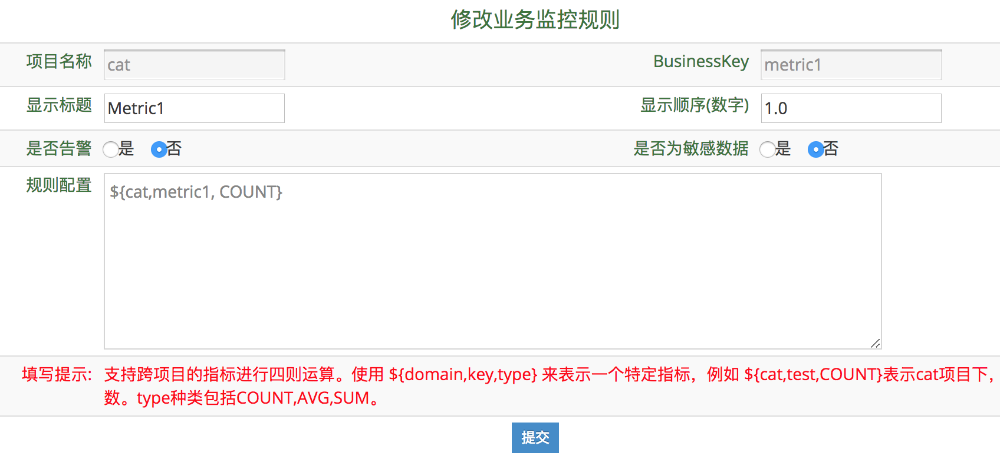

## 业务指标配置

### 业务监控配置

#### 什么是业务指标

与Transaction不同，业务指标更偏向于一个应用在宏观上的指标。

业务指标由logMetric()上报而来，对应```logMetric(String name, Map<String, String> tags)``` 中的name。

如果需要为指标编辑一些可读性更好的标题，或者需要修改图表的展示顺序等，可以到"业务监控配置"编辑页面进行编辑。

#### 如何配置指标

1. 进入CAT后台, 选择应用监控配置-业务监控配置, 输入项目名并回车，进入项目所属业务指标列表页面:


2. 编辑标题(标题用于图表展示和告警)，顺序，是否开启告警，以及是否为敏感数据（敏感数据只显示趋势图，不显示具体值）:



### 业务标签配置

#### 什么是业务标签

业务标签（多维度tag）可以进一步细化指标。比如订单指标，可以额外加上来源、渠道等tag，这样当出现问题时候，可以根据来源、渠道等多种选择条件来看业务指标查询。

业务标签是由logMetric()上而来，对应业务指标对应```logMetric(String name, Map<String, String> tags)``` 中的tags。

#### 如何编辑标签

假设场景：cat项目有业务指标qps，代表每秒访问次数。该指标有两个tag：Android，代表来自安卓的流量；ios，代表来自iOS的流量。

标签配置的Sample如下：

```
<?xml version="1.0" encoding="utf-8"?>
<business-tag-config>
   <tag id="Android">
      <business-item domain="cat" item-id="qps"/>
   </tag>
   <tag id="iOS">
      <business-item domain="cat" item-id="qps"/>
   </tag>
</business-tag-config>
```

配置说明：

tag模型：代表一个业务标签配置

  * property id : 代表tag的id，与上报时的tag id一致；
  
business-item 模型: 代表tag对应的项目及指标

  * property domain : 代表tag对应的项目
  * property item-id : 代表tag对应的指标