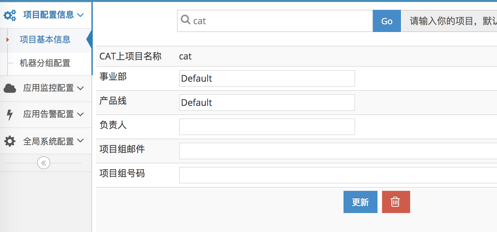
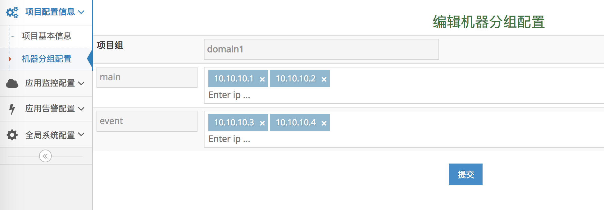

## 项目配置

### 项目配置

#### 配置简介

1. CAT上项目名称：项目接入CAT后的唯一标识，来识别自己
2. 事业部：项目所属事业部
3. 产品线：项目所属产品线
4. 负责人：项目负责人，该项不做为告警联系人
5. 项目组邮件：项目负责人邮件，或项目组产品线邮件，多个邮箱由英文逗号分割，不要留有空格；作为发送告警邮件、微信的依据
6. 项目组号码：项目负责人手机号；多个号码由英文逗号分隔，不要留有空格；作为发送告警短信的依据

### 机器分组配置

#### 机器分组配置简介

1. 项目组: CAT上的项目名
2. 机器分组：配置的几个机器分组
3. 机器IP：对于每个机器分组，在"Enter ip..."处输入对应IP地址，再输入回车
    
#### 为什么需要配置机器分组

将分组内的机器的数据做聚合，方便分析数据。如可以按机房分组，按照路由机器分组等，能够在机房粒度查看数据。
