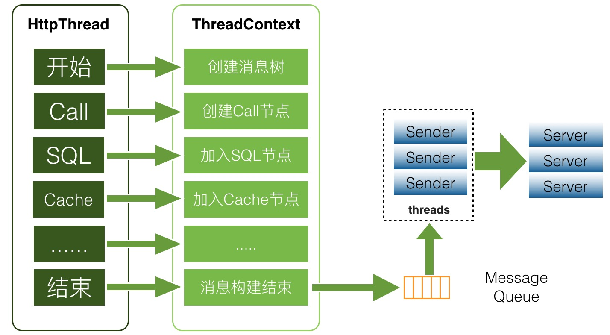
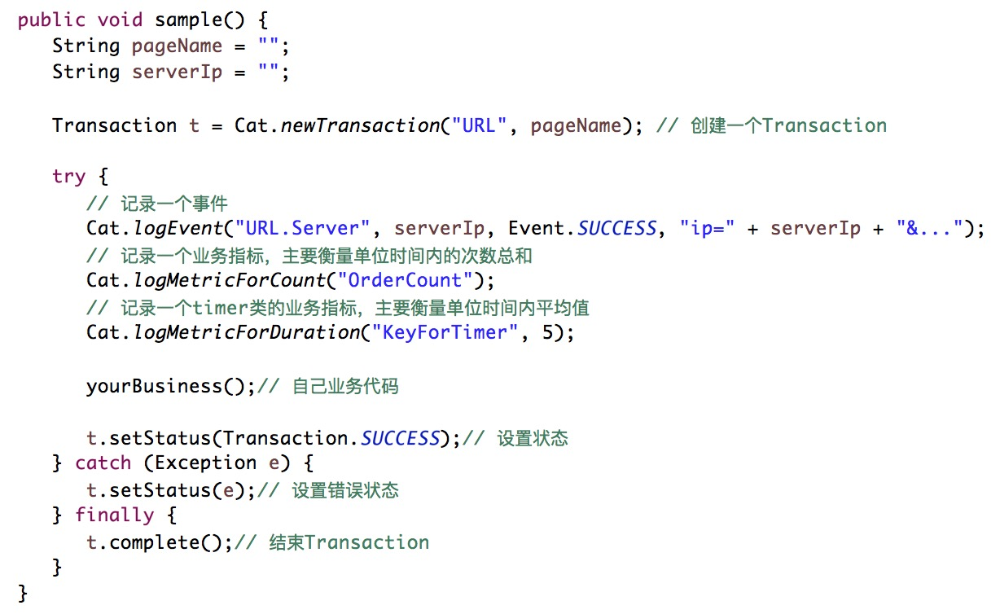

## 客户端设计
客户端设计是CAT系统设计中最为核心的一个环节，客户端要求是做到API简单、高可靠性能、无论在任何场景下客户端都不能影响各业务服务的性能（监控只是公司核心业务流程一个旁路环节）。以下客户端设计以及细节均已java客户端为例子。

### 设计架构
CAT客户端是java，客户端在收集端数据方面使用ThreadLocal，是线程本地变量，也可以称之为线程本地存储。线程局部变量(ThreadLocal)其实的功用非常简单，就是为每一个使用该变量的线程都提供一个变量值的副本，是Java中一种较为特殊的线程绑定机制，是每一个线程都可以独立地改变自己的副本，而不会和其它线程的副本冲突。

在监控场景下，为用户提供服务都是web容器，web容器比如Tomcat或者Jetty，后端的rpc服务端比如dubbo或者点评自研的服务框架pigeon，也都是基于线程池来实现的。业务方在处理业务逻辑时基本都是在一个线程内部调用后端服务，数据库，缓存等，将这些数据拿回来在进行业务逻辑逻辑封装，最后将结果展示给用户。所以将所有的监控请求作为一个监控上下文存入于线程变量就非常合适。
	

如上图业务执行业务逻辑的时候，就会把此次请求对应的监控存放于线程上下文中，存于上下文的其实是一个监控树的结构。在最后业务线程执行结束时，将监控对象存入一个异步内存队列中，CAT有个消费线程将队列内的数据异步发送到CAT服务端。

### API设计
当设计者对监控以及性能分析有足够深度的理解下，才能定义好监控的API，监控和性能分析所针对的场景有如下几种

- 一段代码的执行时间，一段代码可以是URL执行耗时，也可以是SQL的执行耗时
- 一段代码的执行次数，比如程序抛出异常记录次数，或者一段逻辑的执行次数
- 定期执行某段代码，比如定期上报一些核心指标，jvm内存、gc等指标
- 关键的业务监控指标，比如监控订单数、交易额、支付成功率等

在如上的领域模型的基础上，CAT设计自己核心的几个监控对象
Transaction、Event、Heartbeat、Metric

一段监控API的代码示例如下

### 序列化和通信

序列化和通信是整个客户端包括服务端性能里面很关键的一个环节

- CAT序列化协议是自定义序列化协议，自定义序列化协议相比通用序列化协议要高效很多，这个在大规模数据实时处理场景下还是非常有必要的。
- CAT通信是基于Netty来实现的NIO的数据传输，Netty是一个非常好的NIO开发框架，在这边就不详细介绍。

### 客户端埋点
日志埋点是监控活动的最重要环节之一，日志质量决定着监控质量和效率。CAT的埋点目标是以问题为中心，像程序抛出exception就是典型问题。我个人对问题的定义是：不符合预期的就可以算问题。比如请求未完成，响应时间快了慢了，请求TPS多了少了，时间分布不均匀等等。

在互联网环境中，典型的突出的容易出问题的场景，包括跨模块调用，跨公司调用等。比如

- HTTP/REST、RPC/SOA、MQ、Job、Cache、DAL; 
- 搜索/查询引擎、业务应用、外包系统、遗留系统; 
- 第三方网关/银行, 合作伙伴/供应商之间；
- 各类业务指标，如用户登录、订单数、支付状态、销售额。

### 遇到的问题
通常java客户端在业务上使用容易出问题的地方就是内存，另外一个cpu，内存往往是内存泄露，占用内存较多导致业务方gc压力增大。客户端的代码性能决定了最终CPU的消耗。

以前我们遇到过一个极端的例子，我们一个业务请求做餐饮加商铺的销售额，业务一般会通过for循环所有商铺的分店，结果就造成内存OOM了，后来发现这家店是肯德基，有几万分店，每个循环里面都会有数据库连接。在正常场景下，ThreadLocal内部的监控一个对象就存在几万个节点，导致业务Oldgc特别严重。所以说框架的代码是不能想象业务方会怎么用你的代码，需要考虑到任何情况下都可能有出问题的可能。

在消耗CPU方面我们也遇到一个case，在某个客户端版本，CAT本地存储当前消息ID自增的大小，客户端使用了MappedByteBuffer这个类，这个类是一个文件内存映射，测试下来这个类的性能非常高，我们仅仅用这个存储了几个字节的对象，正常情况理论上不会有任何问题。在一次线上一个场景下，很多业务线程都block在这个上面。当系统IO存在瓶颈时候，MappedByteBuffer这个类使用也会变得很慢。后来的优化就是把这个io的操作异步化，所以客户端需要尽可能异步化，异步化序列化，异步化传输，异步化任何可能存在时间延迟的代码操作。
