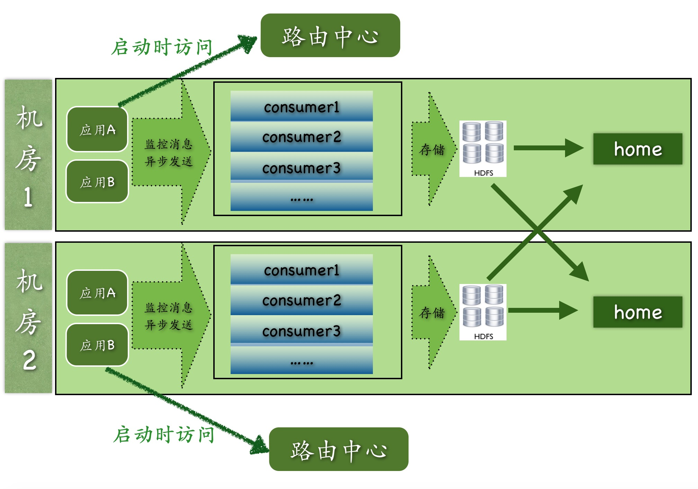

## 整体设计

在整个CAT从开发至今，一直秉承着简单的架构就是最好的架构原则，整个CAT主要分为三个模块，cat-client，cat-consumer，cat-home。

- cat-client 提供给业务以及中间层埋点的底层sdk。
- cat-consumer 用于实时分析从客户端的提供的数据。
- cat-home 作为用户提供给用户的展示的控制端。

在实际开发和部署中，cat-consumer和cat-home是部署在一个jvm内部，每个CAT服务端都可以作为consumer也可以作为home，这样既能减少整个CAT层级结构，也可以增加整个系统稳定性。
  

上图是CAT目前多机房的整体结构图：

- 路由中心是根据应用所在机房信息来决定客户端上报的CAT服务端地址
- 每个机房内部都有的独立的原始信息存储集群HDFS
- cat-home可以部署在一个机房也可以部署在多个机房，在做报表展示的时候，cat-home会从cat-consumer中进行跨机房的调用，将所有的数据合并展示给用户
- 实际过程中，cat-consumer、cat-home以及路由中心都是部署在一起，每个服务端节点都可以充当任何一个角色