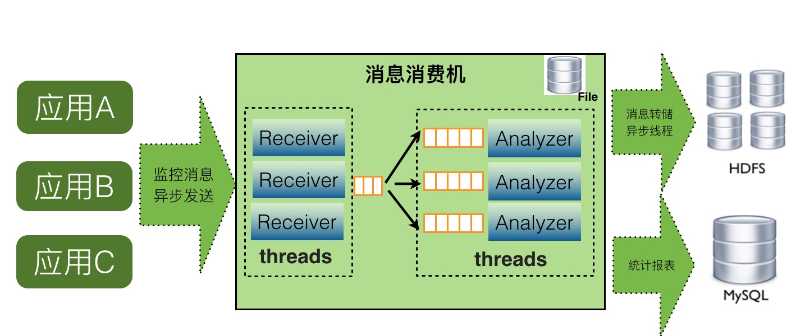
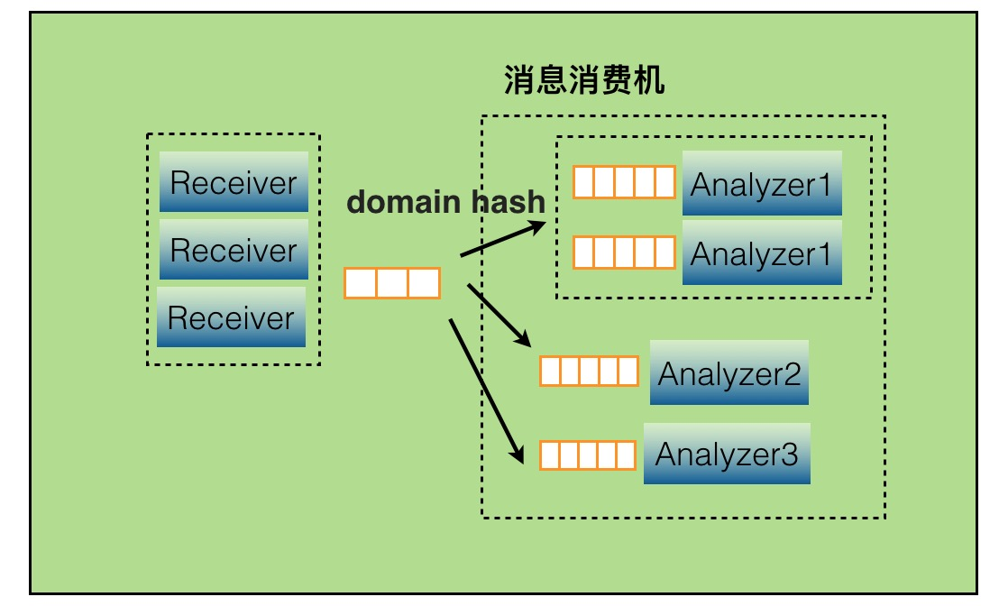
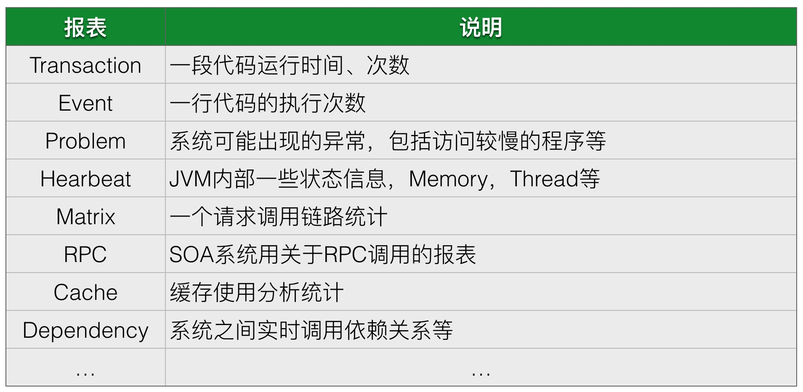
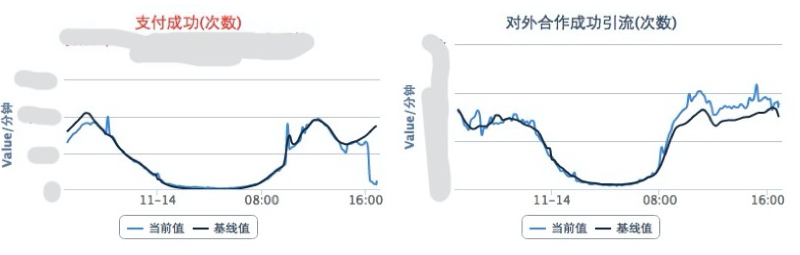
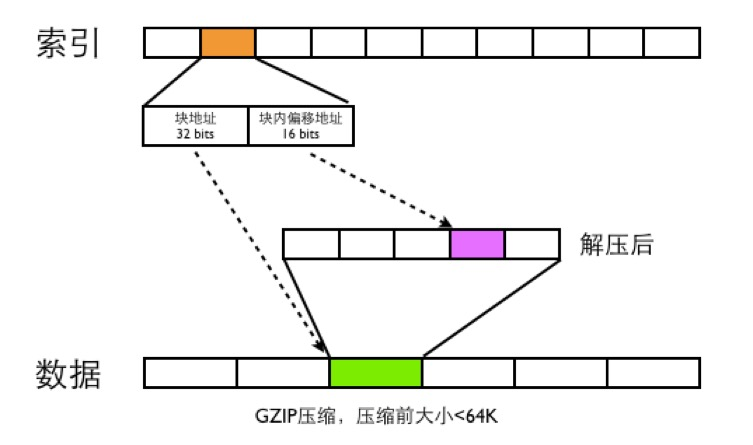

## 服务端设计

服务端主要的问题是大数据的实时处理，截止2017年6月后端CAT的计算集群大约100台物理机，存储集群大约50台物理机，每天处理了约200TB的数据量。下面是CAT服务端一些设计细节:

### 架构设计

服务端单机cat-consumer的整体架构如下：

如上图，CAT服务端在整个实时处理中，基本上实现了全异步化处理。

- 消息接收是基于Netty的NIO实现
- 消息接收到服务端就存放内存队列，然后程序开启一个线程会消费这个消息做消息分发
- 每个消息都会有一批线程并发消费各自队列的数据，以做到消息处理的隔离
- 消息存储是先存入本地磁盘，然后异步上传到hdfs文件，这也避免了强依赖hdfs

当某个报表处理器处理来不及时候，比如Transaction报表处理比较慢，可以通过配置支持开启多个Transaction处理线程，并发消费消息。

### 实时分析

CAT服务端实时报表分析是整个监控系统的核心，CAT重客户端采集的是是原始的Logview，目前一天大约有3000亿的消息，所以需要在这些消息基础上实现丰富报表，以支持业务问题以及性能分析的需要。

CAT根据日志消息的特点(比如只读特性)和问题场景，量身定做的。CAT将所有的报表按消息的创建时间，一小时为单位分片，那么每小时就产生一个报表。当前小时报表的所有计算都是基于内存的，用户每次请求即时报表得到的都是最新的实时结果。对于历史报表，因为它是不变的，所以就实时不实时也就无所谓了。

CAT基本上所有的报表模型都可以增量计算，它可以分为：计数、计时和关系处理三种。计数又可以分为两类：算术计数和集合计数。典型的算术计数如：总个数（count），总和（sum），均值（avg），最大/最小（max/min)，吞吐（tps）和标准差（std）等，其他都比较直观，标准差稍微复杂一点，大家自己可以推演一下怎么做增量计算。那集合运算，比如95线（表示95%请求的完成时间），999线（表示99.9%请求的完成时间），则稍微复杂一些，系统开销也更大一点。

#### 报表建模

CAT每个报表往往有多个维度，以transaction报表为例，它有5个维度，分别是应用、机器、Type、Name和分钟级分布情况。如果全维度建模，虽然灵活，但开销将会非常之大。CAT选择固定维度建模，可以理解成将这5个维度组织成深度为5的树，访问时总是从根开始，逐层往下进行。

CAT服务端为每个报表单独分配一个线程，所以不会有锁的问题，所有报表模型都是非线程安全的，其数据是可变的。这样带来的好处是简单且低开销。

CAT报表建模是使用自研的maven plugin自动生成的。所有报表是可合并和裁剪的，可以轻易地将2个或多个报表合并成一个报表。在报表处理代码中，CAT大量使用访问者模式（visitor pattern）。

#### 性能分析报表

  
  
#### 故障发现报表

- 实时业务指标监控 ：核心业务都会定义自己的业务指标，这不需要太多，主要用于24小时值班监控，实时发现业务指标问题，图中一个是当前的实际值，一个是基准值，基准值是根据历史趋势计算的预测值。如下图就是当时出故障，直观看到支付业务出问题的故障。
 
  
  
- 系统报错大盘
- 实时数据库大盘、服务大盘、缓存大盘等

### 存储设计
CAT系统的存储主要有两块

- CAT的报表的存储
- CAT原始logview的存储

报表是根据logview实时运算出来的给业务分析用的报表，默认报表有小时模式，天模式，周模式以及月模式。CAT实时处理报表都是产生小时级别统计，小时级报表中会带有最低分钟级别粒度的统计。天、周、月等报表都是在小时级别报表合并的结果报表。

原始logview存储一天大约300TB的数据量，因为数据量比较大所以存储必须要要压缩，原始logview需要根据messageId读取。在这样的情况下，存储整体要求就是批量压缩以及随机读。在当时场景下，并没有特别合适成熟的系统以支持这样的特性，所以我们开发了一种基于文件的存储以支持CAT的场景，在存储上一直是最难的问题，我们一直在这块持续的改进和优化。

#### 消息ID的设计
CAT每个消息都有一个唯一的ID，这个ID在客户端生成，后续CAT都通过这个ID在进行消息内容的查找。比如在分布式调用里面，RPC消息需要串起来，比如A调用B的时候，在A这端生成一个MessageId，在A调用B的过程中，将MessageId作为调用传递到B端，在B执行过程中，B用context传递的MessageId作为当前监控消息的MessageId。

CAT消息的MessageId格式ShopWeb-0a010680-375030-2，CAT消息一共分为四段

- 第一段是应用名shop-web
- 第二段是当前这台机器的ip的16进制格式，01010680表示10.1.6.108
- 第三段的375030，是系统当前时间除以小时得到的整点数
- 第四段的2，是表示当前这个客户端在当前小时的顺序递增号

#### 存储数据的设计

消息存储是CAT最有挑战的部分。关键问题是消息数量多且大，目前美团点评每天处理消息3000亿左右，大小大约300TB，单物理机每秒要处理200MB左右的流量。CAT服务端基于此流量做实时计算，还需要将这些数据压缩后写入磁盘。

整体存储结构如下图
  
 
 
CAT数据文件分为两种，一类是index文件，一类是Data文件

- data文件是分段GZIP压缩，每个分段大小小于64K，这样可以用16bits可以表示一个最大分段地址
- 一个MessageId都用需要48bits的空间大小来存索引，索引根据MessageId的第四段来确定索引的位置，比如消息MessageId为ShopWeb-0a010680-375030-2，这条消息ID对应的索引位置为2*48bits的位置
- 48bits前面32bits存数据文件的块偏移地址，后面16bits存数据文件解压之后的块内地址偏移
- CAT读取消息的时候，首先根据MessageId的前面三段确定唯一的索引文件，在根据MessageId第四段确定此MessageId索引位置，根据索引文件的48bits读取数据文件的内容，然后将数据文件进行GZIP解压，在根据块内偏移地址读取出真正的消息内容，

#### 服务端设计总结

CAT在分布式实时方面，主要归结于以下几点因素：

- 去中心化，数据分区处理
- 基于日志只读特性，以一个小时为时间窗口，实时报表基于内存建模和分析，历史报表通过聚合完成
- 基于内存队列，全面异步化，单线程化，无锁设计
- 全局消息ID，数据本地化生产，集中式存储
- 组件化、服务化理念