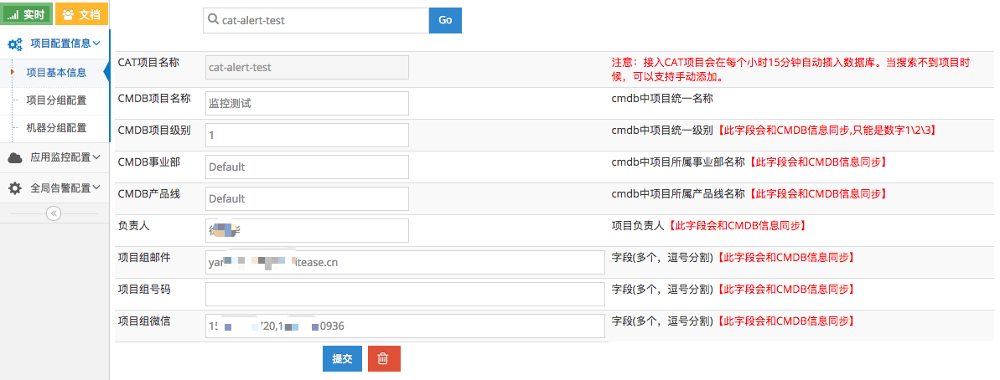
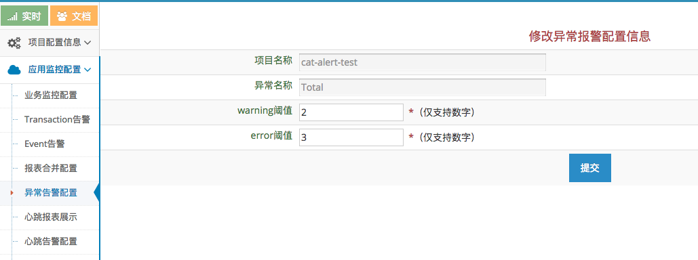
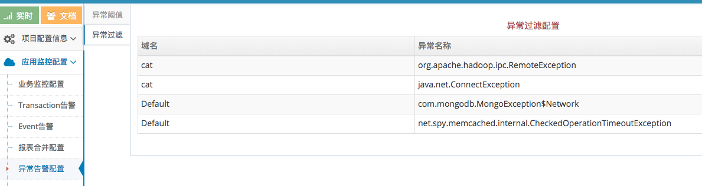
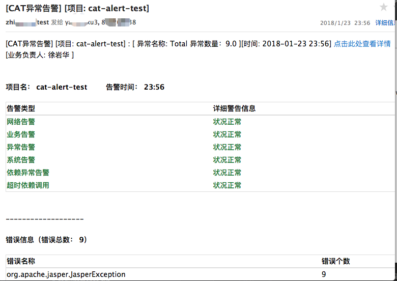
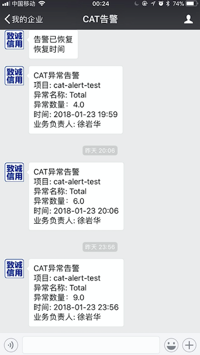

# CAT异常告警
## 1、部署
### 1.1、CAT服务端
### 1.1.1、修改告警模板
CAT告警的模板（主要是邮件使用）中，链接到CAT管理页面的url是写死的，而我们公司内部署CAT后都会指定一个host域名，
没有域名的一般也有ip:port。看下文件cat/cat-home/src/main/resources/freemaker/exceptionAlert.ftl<br/>
```html
[CAT异常告警] [项目: ${domain}] : ${content}[时间: ${date}]
<a href='http://cat-url/cat/r/p?domain=${domain}&date=${linkDate}'>点击此处查看详情</a><br/>
${contactInfo}<br/>
```
把其中的cat-url修改为你部署的cat的域名或ip:port，比如：
```html
[CAT异常告警] [项目: ${domain}] : ${content}[时间: ${date}]
<a href='http://127.0.0.1:2281/cat/r/p?domain=${domain}&date=${linkDate}'>点击此处查看详情</a><br/>
${contactInfo}<br/>
```
### 1.1.2、添加微信渠道支持
* 修改代码生成配置文件<br/>
cat/cat-core/src/main/resources/META-INF/dal/jdbc/report-codegen.xml，在project表的phone字段后添加
```xml
<member name="weixin" field="weixin" value-type="String" length="200" />
```
* 修改jsp添加微信配置输入框<br/>
修改/Users/xuyanhua/IdeaProjects/cat/cat-home/src/main/webapp/jsp/system/project/project.jsp，在项目组号码后添加
```html
<tr>
   <td>项目组微信</td>
   <td><input type="text" name="project.weixin" class="input-xxlarge" value="${model.project.weixin}"/></td>
   <td>字段(多个，逗号分割)<span  style="color:red">【此字段会和CMDB信息同步】</span></td>
</tr>
```
* 添加联系人获取微信方式<br/>
修改cat/cat-home/src/main/java/com/dianping/cat/report/alert/sender/receiver/ProjectContactor.java，修改方法queryWeiXinContactors
```Java
@Override
public List<String> queryWeiXinContactors(String id) {
   List<String> weixinReceivers = new ArrayList<String>();
   Receiver receiver = m_configManager.queryReceiverById(getId());

   if (receiver != null && !receiver.isEnable()) {
      return weixinReceivers;
   } else {
      weixinReceivers.addAll(buildDefaultWeixinReceivers(receiver));

      if (StringUtils.isNotEmpty(id)) {
         Project project = m_projectService.findByDomain(id);

         if (project != null) {
            weixinReceivers.addAll(split(project.getWeixin()));//由getMail() --> getWeixin()
         }
      }
      return weixinReceivers;
   }
}
```
### 1.2、告警服务端
#### 1.2.1、下载与安装
下载cat/框架埋点方案集成/cat-alert/cat-alert
#### 1.2.2、环境要求
linux系统、Python2.7
#### 1.2.3、运行
```bash
bogon:tmp xuyanhua$ cd cat-alert/
bogon:cat-alert xuyanhua$ ls
ChangeLog.txt       README          cat-alert       cat-alert.sh        main.spec       requirements.txt    setup.py
bogon:cat-alert xuyanhua$ chmod +x cat-alert.sh
bogon:cat-alert xuyanhua$ ./cat-alert.sh
USAGE: ./cat-alert.sh start [port]
       ./cat-alert.sh stop
       ./cat-alert.sh restart [port]
bogon:cat-alert xuyanhua$ ./cat-alert.sh start 8888
start ok!
see log use "tail -f debug.log"
bogon:cat-alert xuyanhua$ tail -f debug.log
[2018-01-18 16:59:20] [INFO] main.py[line:65] ----------------------------------------------
[2018-01-18 16:59:20] [INFO] main.py[line:66] cat-alert Server startup and listen on 8888.
[2018-01-18 16:59:20] [INFO] main.py[line:67] ----------------------------------------------
```
### 1.3、数据库脚本
* 添加微信配置字段的sql脚本
```sql
alter table project add column weixin varchar(200) after phone;
```
### 1.4、依赖支持
#### 1.4.1、邮件告警
发送邮件，需要依赖邮件服务器，目前cat的邮件服务器由运维同事提供，在后续的2.1.3 全局告警配置-告警服务端中配置。
如果想通过公网邮件服务器，需要开通访问外网的权限
#### 1.4.2、微信告警
微信消息的发送，是基于微信企业号。需要访问外网权限，具体来说是https://qyapi.weixin.qq.com
## 2、配置
### 2.1、全局告警配置
#### 2.1.1、全局告警配置-告警策略
```xml
<?xml version="1.0" encoding="utf-8"?>
<alert-policy>
   <type id="Network">
      <group id="default">
         <level id="error" send="mail,weixin,sms" suspendMinute="3"/>
         <level id="warning" send="mail,weixin"/>
      </group>
   </type>
   <type id="Exception">
      <group id="default">
         <level id="error" send="mail,weixin"/>
         <level id="warning" send="weixin"/>
      </group>
   </type>
   <type id="Business">
      <group id="default">
         <level id="error" send="mail,weixin,sms" suspendMinute="5"/>
         <level id="warning" send="mail,weixin" suspendMinute="5"/>
      </group>
   </type>
   <type id="System">
      <group id="default">
         <level id="error" send="mail"/>
         <level id="warning" send="mail"/>
      </group>
   </type>
   <type id="ThirdParty">
      <group id="default">
         <level id="warning" send=""/>
      </group>
   </type>
   <type id="FrontEnd">
      <group id="default">
         <level id="warning" send="mail"/>
      </group>
   </type>
   <type id="App">
      <group id="default">
         <level id="warning" send="mail,weixin"/>
         <level id="error" send="mail,weixin,sms"/>
      </group>
   </type>
   <type id="Web">
      <group id="default">
         <level id="warning" send="mail"/>
         <level id="error" send="mail,weixin,sms"/>
      </group>
   </type>
   <type id="Heartbeat">
      <group id="default">
         <level id="warning" send="mail"/>
         <level id="error" send="mail,weixin,sms"/>
      </group>
   </type>
   <type id="default">
      <group id="default">
         <level id="warning" send="mail"/>
         <level id="error" send="mail,weixin,sms"/>
      </group>
   </type>
</alert-policy>
```
#### 2.1.2、全局告警配置-默认告警人
```xml
<?xml version="1.0" encoding="utf-8"?>
<alert-config>
   <receiver id="Network" enable="false">
      <email>cat@yourcompany.com</email>
      <phone>152********</phone>
   </receiver>
   <receiver id="Exception" enable="true">
      <email>cat@yourcompany.com</email>
      <weixin>152********</weixin>
   </receiver>
   <receiver id="FrontEndException" enable="false">
      <email>cat@yourcompany.com</email>
      <phone>152********</phone>
   </receiver>
   <receiver id="Business" enable="false">
      <email>cat@yourcompany.com</email>
      <phone>152********</phone>
   </receiver>
   <receiver id="System" enable="false">
      <email>cat@yourcompany.com</email>
      <phone>152********</phone>
   </receiver>
   <receiver id="ThirdParty" enable="false">
      <email>cat@yourcompany.com</email>
      <phone>152********</phone>
   </receiver>
   <receiver id="App" enable="false">
      <email>cat@yourcompany.com</email>
      <phone>152********</phone>
   </receiver>
   <receiver id="Web" enable="false">
      <email>cat@yourcompany.com</email>
      <phone>152********</phone>
   </receiver>
   <receiver id="Heartbeat" enable="false">
      <email>cat@yourcompany.com</email>
      <phone>152********</phone>
   </receiver>
</alert-config>
```

#### 2.1.3、全局告警配置-告警服务端
```xml
<?xml version="1.0" encoding="utf-8"?>
<sender-config>
   <sender id="mail" url="http://127.0.0.1:8888/mail/" type="post" successCode="200" batchSend="true">
      <par id="type=1500"/>
      <par id="subject=${title}"/>
      <par id="content=${content}"/>
      <par id="smtp_server=smtp.sina.com"/>
      <par id="from_addr=cat@sina.com"/>
      <par id="username=cat@sina.com"/>
      <par id="password=***"/>
      <par id="to_addrs=${receiver}"/>
   </sender>
   <sender id="weixin" url="http://127.0.0.1:8888/weixin/" type="post" successCode="success" batchSend="true">
      <par id="domain=${domain}"/>
      <par id="weixins=${receiver}"/>
      <par id="title=${title}"/>
      <par id="content=${content}"/>
      <par id="type=${type}"/>
   </sender>
   <sender id="sms" url="http://127.0.0.1:8888/sms/" type="post" successCode="200" batchSend="false">
      <par id="jsonm={type:808,mobile:'${receiver}',pair:{body='${content}'}}"/>
   </sender>
</sender-config>
```
`注：这里的“http://127.0.0.1:8888”指的是1.2节中提到的"告警服务端"的 ip:port`
### 2.2、项目告警配置
想要使用告警功能，需要三步
* 配置项目基本信息，如项目名、小组名、负责人，邮箱地址、微信id等（建议由管理员配置）
* 配置阈值配置，有两个阈值，分别为warning和error两个级别，两个级别分别控制发送邮件和微信
* 异常过滤配置，如果项目中某个异常没有“危害”，可以将之过滤掉
#### 2.2.1、项目配置信息-项目基本信息

#### 2.2.2、应用监控配置-异常告警配置-异常阈

`注意，这里的Total指所有异常，如果想指定特定异常也可以。`
#### 2.2.1、应用监控配置-异常告警配置-异常过滤配置

如果某些异常不想报警，也可以过滤掉
要想接收微信告警，要扫码加入微信企业号。
加入微信企业号，然后在项目基本信息中配置上，在发生异常时就能收到告警消息了。<br/>
`注：扫完后要进去点一下申请加入，填写自己的真实姓名和手机号。`<br/>
`注：由于目前微信企业号的pc端对mac的支持不好，因此使用mac电脑的同事，需要安装微信企业，pc端才能收到告警消息。`<br/>
下载地址：https://work.weixin.qq.com/<br/>
`注：如果pc端登录着微信，手机端微信可以接收到告警消息，但没有通知栏提醒，可以通过下面的二微码安装企业微信客户端。`
## 3、告警效果一览
### 3.1、邮件告警效果

### 3.2、微信告警效果

## 4、后记
最后，如果大家遇到问题，欢迎在"开源实时监控CAT二群"微信群里 @徐岩华@宜信致诚。

