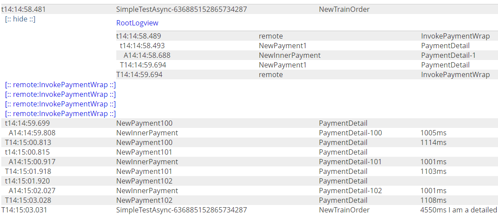
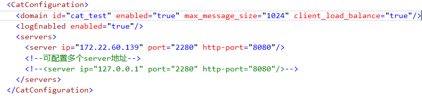
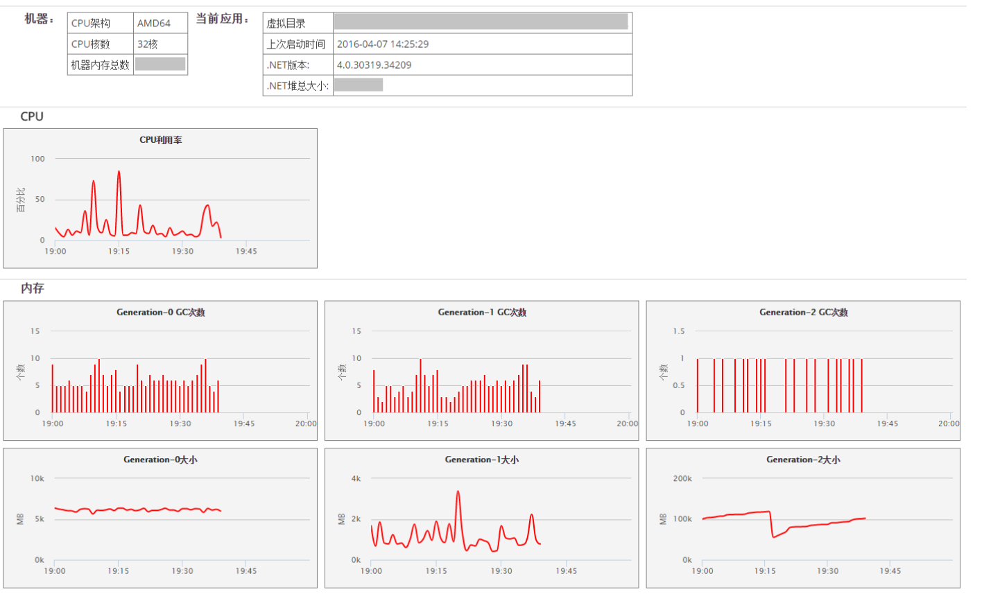

本客户端改进自 <a href="https://github.com/ctripcorp/cat.net">ctripcorp/cat.net</a>
### 改动点：
1. 支持异步调用: 使用AsyncLocal替换原先的 ThreadLocal(线程上下文，不支持async/await)
2. 支持异步并发调用;需要显示调用 Cat.NewForkedTransaction("remote", "<<Service Name>>")开启新的调用上下文。
Sample:
```
# 并行调用
 var tasks = Enumerable.Range(1, 5).Select(async (i) =>
 {
     await InvokePaymentWrap(i).ConfigureAwait(false);
 });

 await Task.WhenAll(tasks);

 # InvokePaymentWrap方法需要调用NewForkedTransaction
 private static async Task InvokePaymentWrap(int i)
 {
     var forkedTran = Cat.NewForkedTransaction("remote", "InvokePaymentWrap");
     asyncLocal.Value = new Context() { Value = i };
     try
     {
         await InvokePayment(i).ConfigureAwait(false);
         forkedTran.Status = CatConstants.SUCCESS;
     }
     catch (Exception ex)
     {
         forkedTran?.SetStatus(ex);
     }
     finally
     {
         forkedTran?.Complete();
     }
 }
```
CAT显示效果：


3. 支持从Config中读取server的配置信息(CatConfigurationSection); 去除对d:\data\appdatas\cat\client.xml配置文件的依赖



4. 数据库访问Wrap类(DBUtil), 帮助在业务代码前后开启和结束Transaction
- WrapWithCatTransaction
- WrapWithCatTransactionAsync
Sample:
```
public virtual async Task UpdateAsync(TEntity entity)
{
    await Org.Unidal.Cat.DBUtil.WrapWithCatTransactionAsync(async () =>
    {
 
        ValidUpdateEntity(entity);

        await DoUpdateAsync(entity);
        await SaveChangesAsync();

        OnUpdateEntity(entity);
    }, typeof(TEntity).Name, "UPDATEASYNC");
}
```
5. 支持NET Core

### 需求
.Net Framework 4.6.1 或 .Net Standard 2.0 _(如需支持.Net Framework 4.5, 可自行clone, 使用CallContext替换AsyncLocal)_

用Visual Studio 2017或更高版本，打开Cat.sln。可以看到Solution中包括四个个工程：
1. Cat：CAT.net客户端实现代码
2. CatCore: .Net Standard版本
3. CatClientTest: 示例程序和测试用例。
4. CatCoreClientTest:  .Net Standard版本示例程序

### 配置
请在App.config里添加CatConfiguration section
```
<configSections>
    <section name="CatConfiguration" type="Org.Unidal.Cat.Configuration.CatConfigurationSection,Cat"/>
  </configSections>

  <CatConfiguration>
    <domain id="cat_test" enabled="true" max_message_size="1024" client_load_balance="true"/>
    <logEnabled enabled="true"/>
    <servers>
      <server ip="172.22.60.139" port="2280" http-port="8080"/>
      <!--可配置多个server地址-->
      <!--<server ip="127.0.0.1" port="2280" http-port="8080"/>-->
    </servers>
  </CatConfiguration>
```

### 客户端埋点示例
```
 private static async Task InvokePayment(int i)
 {
     ITransaction paymentTransaction = null;
     try
     {
         paymentTransaction = Cat.NewTransaction("NewPayment" + i, "PaymentDetail");

         // Do Business Staff

         paymentTransaction.Status = CatConstants.SUCCESS;
     }
     catch (Exception ex)
     {
         paymentTransaction.SetStatus(ex);
         throw;
     }
     finally
     {
         paymentTransaction.Complete();
     }
 }
```
### 心跳报表
