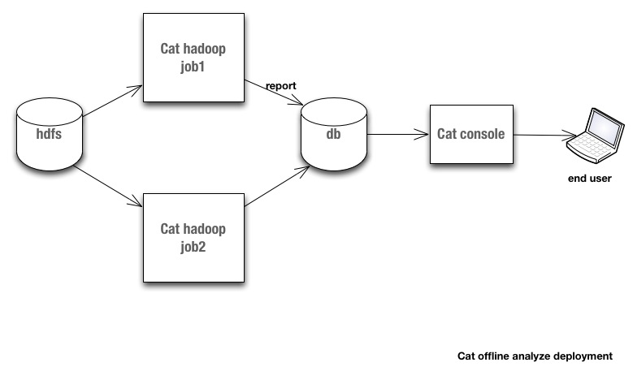

<head><meta http-equiv="Content-Type" content="text/html;charset=utf-8"/></head>
# 背景
本文描述了CAT的概要结构, 以及如何使用cat分析应用程序的方法和最佳实践. 这篇文档是第1版, 我们会及时更新本文档. 如果你有任何问题, 请联系CAT团队成员.

----------------------------------
# 概要介绍 
Cat实时分析部署结构:

Cat离线分析部署结构:

-----------------------------------------------------
# 环境设置

## 依赖
如果你的java项目基于maven管理,仅需要在pom.xml里加入cat-core项目依赖即可.
~~~~.xml
<dependency>
    <groupId>com.dianping.cat</groupId>
    <artifactId>cat-core</artifactId>
    <version>0.2.4</version>
</dependency>
~~~~
同时你需要确认你的maven的conf.xml配置的是点评公司的仓库地址.

## 配置文件
你需要修改这个文件:/data/appdatas/cat/client.xml, windows机器前面还要加上程序当前运行根目录所在的盘符.

~~~~
<config mode="client" xmlns:xsi="http://www.w3.org/2001/XMLSchema" xsi:noNamespaceSchemaLocation="config.xsd">
        <servers>
                <server ip="192.168.7.43"/>
        </servers>
        <domain id="your domain id"/>
</config>
~~~~

server
: ip表示cat客户端收集到的消息发送的cat服务器. 测试服务器地址http://192.168.7.43:8080/cat/r . 线上的应用一般配多个server来实现容灾和负载均衡.
domain
: id表示消息归属的domain name, 这会体现在cat服务端实时报表的domain分类上. 如果需要关闭cat消息收集, domain节点增加属性项enable="false"即可.

------------------------------------
# CAT消息API

## 消息协议
CAT客户端可以向服务端发送Transaction, Event, Heartbeat三种消息. 消息的传输格式如下:

~~~~
<Class><Timestamp>\t<Type>\t<Name>[\t<Status][\t<Duration>][\t<Data>]
~~~~

如:

~~~~
H2012-04-26 16:00:42.775        Heartbeat       192.168.63.141  0  <os name="Mac OS X" arch="x86_64" version="Mac OS X"/>
~~~~

### Class
有5种Cat消息类别, 每种类别用1个字符表示:
t
: Transaction开始 
T
: Transaction结束
A
: Atomic Transaction
E
: Event
H
: Heartbeat

### Transaction
某些运行期单元要花费一定时间完成工作, 内部需要其他处理逻辑协助, 我们定义为Transaction. Transaction可以嵌套(如http请求过程中嵌套了sql处理). 大部分的Transaction可能会失败, 因此需要一个结果状态码. 如果Transaction开始和结束之间没有其他消息产生, 那它就是Atomic Transaction(合并了起始标记).

### Heartbeat
Heartbeta表示程序内定期产生的统计信息, 如CPU%, MEM%, 连接池状态, 系统负载等.

### Event
Event表示所有其他不能归属到Transaction或者Heartbeat的消息. 包括警告, 错误, 业务提示信息, 以及CAT自身的内部信息.

### Timestamp
记录消息产生的时刻, 格式"yyyy-mm-dd HH:MM:SS.sss".

### Type
大小写敏感的字符串. 常见的Transaction type有 "URL", "SQL", "Email", "Exec"等. 常见的Event type有 "Info", "Warn", "Error", 还有"Cat"用来表示Cat内部的消息.

### Name
大小写敏感的字符串. type和name的组合要满足全局唯一性. 常见的URL transaction type的name如 "ViewItem", "MakeBid", "SignIn"等. SQL transaction type的name如 "AddFeedback", "GetAccountDetailUnit4", "IncrementFeedbackAndTotalScore"等.

### Status
大小写敏感的字符串. 0表示成功, 非零表示失败. 建议不要使用太长的字符串. Transaction start没有status字段.

### Duration
精确到0.1毫秒. 表示transaction start和transaction end之间的时间长度. 仅出现在Transaction end或者Atomic Transaction. Event和Heartbeat没有duration字段.

### Data
建议使用以&字符分割的name=value对组成的字符串列表. Transaction start没有data字段.

## 实现
我们建议程序内部跨越边界访问的活动都需要记录下Cat消息. 另外, 三种基本消息Transaction, Event, Heartbeat何时使用, 请参见下图:

### Transaction
当你准备要使用Transaction时,请遵循下图的流程:

这里是Transaction的api:

com.dianping.cat.message.MessageProducer:
~~~~.java
        Transaction newTransaction(String type, String name);
~~~~

com.dianping.cat.message.Transaction:
~~~~.java
        void addData(String keyValuePairs);

        void addData(String key, Object value);

        void setStatus(String status);

        void complete();
~~~~

### Event
当你准备要使用event时,请遵循下图的流程:

这里是Event的api:

com.dianping.cat.message.MessageProducer:
~~~~.java
        void logEvent(String type, String name, String status, String keyValuePairs);

        Event newHeartbeat(String type, String name);
~~~~

com.dianping.cat.message.Event:
~~~~.java
        void addData(String keyValuePairs);

        void addData(String key, Object value);

        void setStatus(String status);

        void complete();
~~~~

### Heartbeat
当你准备要使用heartbeat时,请遵循下图的流程:

这里是Heartbeat的api:

com.dianping.cat.message.MessageProducer:
~~~~.java
        void logHeartbeat(String type, String name, String status, String keyValuePairs);

        Heartbeat newHeartbeat(String type, String name);
~~~~

com.dianping.cat.message.Heartbeat:
~~~~.java
        void addData(String keyValuePairs);

        void addData(String key, Object value);

        void setStatus(String status);

        void complete();
~~~~

## 已经实现Cat集成的框架
### Avatar/Avatar-Biz (URL, Action)
### Zebra (SQL)
### Pigeon (Call, Result)
### Ox (TBD)
### Swallow (TBD)

--------------------------------------- 
# 插件开发
## 实时报表插件
Cat服务端接收到消息后, 分发给报表插件模块. 实时生成报表. 目前有Transaction, Event, Heartbeat, Problem, IP等5张实时报表. 如业务需要增加新的实时报表, 请练习Cat团队.

## Hadoop任务
Cat服务端每隔1小时会把所有的消息备份到hdfs服务器, 定期执行的hadoop job分析备份数据, 生成SQL统计报表. 如业务需要增加新的统计报表, 请练习Cat团队.

------------------------------------------
# FAQ
## Cat是什么
Cat是通过客户端埋点实时收集程序运行消息, 在服务端分析程序运行状况, 生成统计报表的工具.

## Cat不是什么
* Cat需要客户端埋点来收集程序运行消息, 不要指望它能发现埋点范围之外的问题.
* Cat能帮助你发现问题, 但是不能帮你解决问题

